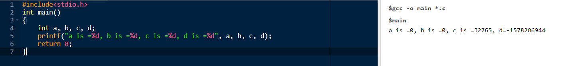

# C Programming

<hr>


<hr>

- Made by **Dennis Ritchie**

<hr>

# Hello World Program

<hr>

```c
#include<stdio.h>

main()
{
    printf("Hello World"); //printf==print format
}
```

<hr>


<hr>

# Variable Declaration

<hr>

```c
#include<studio.h>

main()
{
    float a=5.5;
    int b=5;
    char c='y'; //For single character, single inverted commas, else double.

}
```

<hr>

# Simple Arithematic Operation

<hr>

```c
#include<stdio.h>

main()
{
    int a=1;
    int b=2;
    printf("The addition of %d and %d is %d",a,b,a+b);//"%d" in order to specify that we are to print integer.
}
```

<hr>


<hr>

# Return Type

<hr>

- Till now we saw that output does appears correctly, but a small warning comes comes for main. This happens because the function main should return something. Hence this is the reason that we use the following syntax to code correctly.

<hr>

```c
int main() // Called 'return type'
{
    //Code

    return 0;
}
```

<hr>

# Garbage Value

<hr>

- Just observe the output of the following code:-

<hr>

```c
#include<stdio.h>
int main()
{
    int a, b, c, d;
    printf("a is =%d, b is =%d, c is =%d, d is =%d", a, b, c, d);
    return 0;
}
```

<hr>



<hr>

- These values came becuse when we initialised a, b, c, d as int's, then they got a default value and got stored in memory.

<hr>

# Taking Inputs

<hr>

- In order