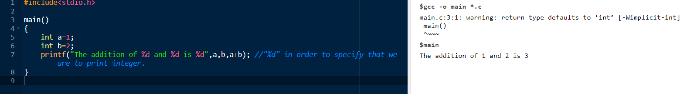

# C Programming

<hr>


<hr>

- Made by **Dennis Ritchie**

<hr>

# Hello World Program

<hr>

```c
#include<stdio.h>

main()
{
    printf("Hello World"); //printf==print format
}
```

<hr>


<hr>

# Variable Declaration

<hr>

```c
#include<studio.h>

main()
{
    float a=5.5;
    int b=5;
    char c='y'; //For single character, single inverted commas, else double.

}
```

<hr>

# Simple Arithematic Operation

<hr>

```c
#include<stdio.h>

main()
{
    int a=1;
    int b=2;
    printf("The addition of %d and %d is %d",a,b,a+b);//"%d" in order to specify that we are to print integer.
}
```

<hr>



<hr>

