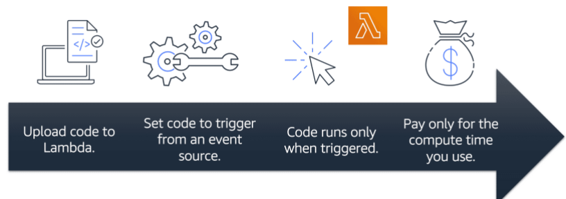

<h1 align="Center">AWS Cloud Essentials</h1>

These are the notes I am making for [AWS Cloud Practitioner](https://www.coursera.org/learn/aws-cloud-practitioner-essentials) course.

# Cloud Computing

- The on demand delivery of IT resources with pay as you go pricing.

<h1>Client Server Model</h1>

- A very nice concept wherein there is a client which makes a request to the servers in order to provide the required information/ access ...
- A server can be services like **Amazon Elastic Compute Cloud** (*Amazon EC2*), a type of virtual server.

<h1>Deployment Models For Cloud Computing</h1>

- There are three clod computing deployment models namely

- <h2>Cloud Based Development</h2>

- Run all parts of application in the cloud.
- Migrate existing applications to the cloud.
- Design and build new applications in the cloud.

- ## On Premises Deployment

- Also known as **Private Cloud Deployment**.
- Deploy resources on premises by using virtualization and resource management tools.

- ## Hybrid Deployment

- Combination of on premise deployment and cloud based deployment.
- Here we connect cloud based resources to in premise infrastructure.

<h1>Benefits Of Cloud Computing</h1>

- ## Increase Speed And Agility

- Easy development and deployment.
- Low latency

# Amazon Elastic Compute Cloud (Amazon EC2)

- Amazon Elastic Compute Cloud(Amazon EC2) provides secure, resizable compute capacity in the cloud as Amazon EC2 instances.

## Advantages

- You can provision and launch an Amazon EC2 instance within minutes.
- You can stop using it when you have finished running a workload.
- You pay only for the compute time you use when an instance is running, not when it is stopped or terminated.
- You can save costs by paying only for the server capacity that you need or want.

# How Amazon EC2 Works

- ## Launch

- So firstly, launch an instance.
- Here you select operating system, application server, or applications.
- You specify security settings to control the network of traffic that can flow into and out of your instance.

- ## Connect

- Next, we simply connect our  programs and applications to the instance.

# Amazon EC2 Instance Types

- In order to cater different requirements of users, Amazon EC2 has several types of instances, namely:

- ## General Purpose Instance

- A balance of compute, memory, and networking resources.
- Can be used for 
- Application servers
- Gaming Servers
- Backend services for enterprise applications
- Small and medium databases

- ## Memory Optimized

- For application dealing with large datasets in memory.
- Memory is a temporary storage area.

- ## Compute Optimized

- Used wherein there is a requirements of high performance processors.

- ## Accelerated Computing

- Use of hardware accelerators, coprocessors is prevalent here in order to perform functions more efficiently than is possible 

- ## Storage Optimized

- Used wherein there is a requirement of high local storage.

# Amazon EC2 Pricing

- With Amazon EC2, you pay only for the compute time that you use.
- It offers a variety of pricing options for different use cases.

- ## On-Demand

- Ideal for short term, irregular workloads that cannot be interrupted.

- ## Amazon EC2 Saving Plans

- This plan enables us to reduce the computer costs by committing to a consistent amount of compute usage for a 1-year or 3-year term.
- Results in savings of up to 72% over On-Demand costs.

- ## Reserved Instances

- These are billing discount applied to the use of On-Demand instances in your account.
- You can purchase Standard Reserved and Convertible Reserved Instances.

- ## Spot Instances

- Ideal for workloads with flexible start and end times, or that can withstand interruptions.

- ## Dedicated Hosts

- Dedicated hosts are the physical servers with Amazon EC2 instance that is fully dedicated to your use.

# Scaling Amazon EC2

- Amazon EC2 Auto Scaling scales the number of EC2 instances automatically according to the demands of the customers.
- This auto scaling is done in two types:

- *Dynamic Scaling*: Responds to changing demands.
- *Predictive Scaling*: Automatically schedules the right number of Amazon instances based on predicted demand.

- ## Minimum Capacity:

- When we create an auto-scaling group, then we also set the minimum number of Amazon EC2 instances.
- Minimum capacity is the number of Amazon EC2 instances that launch immediately after you have created Auto Scaling group.

- ## Desired Capacity

- General number of instances which we prefer to have for out application.
- Note: If we don't specify the desired number of Amazon EC2 instances, then the minimum number itself becomes the desired number.

# Elastic Load Balancer

- Elastic load balancing is the AWS service that automatically distributed incoming application traffic across multiple resources, such as Amazon EC2 instances.
- Elastic Load Balancing and AMazon EC2 Scaling are separate services, but still they work together.

# Tightly Coupled Architecture

- This is a type of architecture wherein if a single component fails at any point of time, then all the component starts to malfunction.

# Loosely Coupled Architecture

- This is a type of architecture, wherein failure of a single component does not leads to the malfunctioning of rest of the components.
- All the component still continues to function correctly.

# Monolithic Applications

- Suppose if we have a tightly coupled architecture, then it might also include databases, servers, and the user interface, etc. This type of architecture is known as *Monolithic Application*.

# Microservices

- Loosely coupled applications are simply said to be microservies.
- Two services facilitate application integration: 
- **Amazon SNS**: Amazon Simple Notification Service
- **Amazon SQS**: Amazon Simple Queue Service

# Amazon Simple Notification Service (Amazon SNS)

- Amazon SNS is a publish/ subscribe service.
- Using Amazon SNS, a publisher publishes message to subscribers.
- This is similar to the coffee shop, the cashier provides coffee orders to the barista who makes the drinks.
- In Amazon SNS, subscribers can be web servers, email addresses, AWS Lambda functions, or several other options.

# Amazon Simple Queue Service (Amazon SQS)

- Suppose if a server is already working on some request, then the whole system would fail if AWS keeps on sending more and more request to that server, as those request would get lost, and our application is thus gonna break.
- So, as a solution, we have something called SQS (Simple Queue Service), which enables us to send, store and receive messages between software components, without losing messages or requiring other services to be available.

# Serverless Computing

- There is a slight problem in using Amazon EC2 for running application, they are:

- Provision instances (Virtual Servers)
- Upload your code
- Continue to manage the instances while your application is running.

- So to tackle all these issues, came the serverless computing.

- So, in serverless computing, we only focus on application instead of also maintaining the servers.
- In AWS service for serverless computing is **AWS Lambda**

# AWS Lambda

- AWS Lambda is a service that lets you run code without needing to provision or manage servers.

# Containers

- Containers provide you with a standard way to package your application's code and dependencies into a single object.

- But container management becomes a problem when we have tons of hosts each having hundreds of containers.

# Amazon Elastic Container Service (Amazon ECS)

- Amazon ECS is a highly scalable, high performance container management system that enables you to run and scale containerized application on AWS.

# Selecting A Region

- If AWS were to be located on a single region only, then due to unexpected failure of that data center, application from all over the world might stop working.
- Hence in order to avoid this 

- ## Proximity To Customers

- Selecting regions that are closer to customer leads to the faster delivery of data and resources.