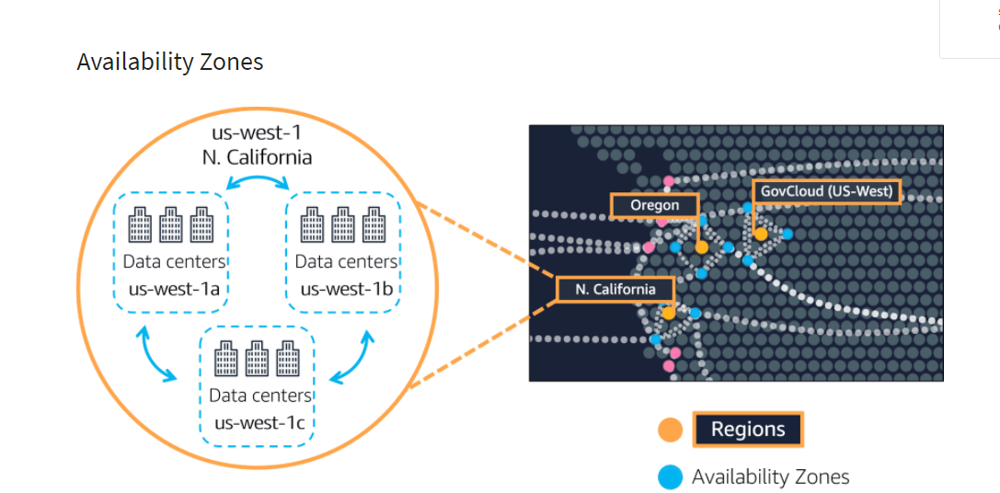
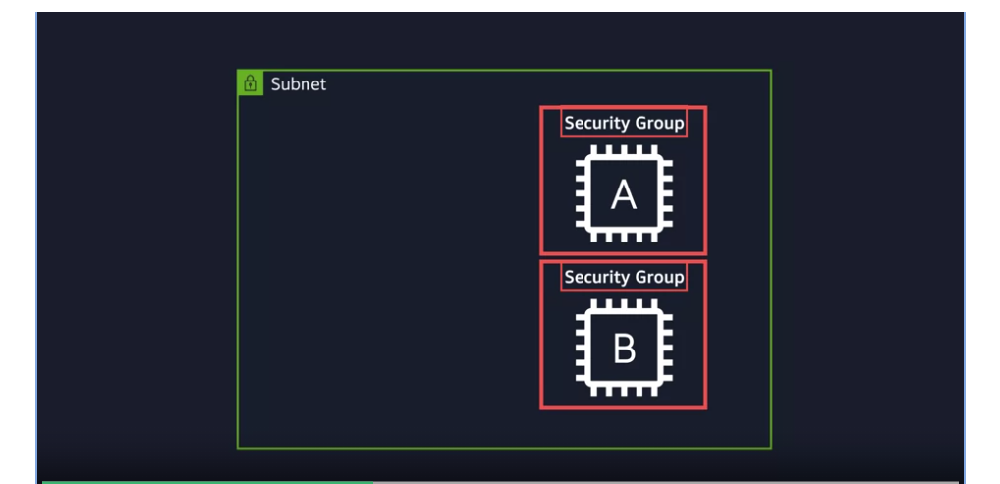

<h1 align="Center">AWS Cloud Essentials</h1>

These are the notes I am making for [AWS Cloud Practitioner](https://www.coursera.org/learn/aws-cloud-practitioner-essentials) course.

# Cloud Computing

- The on demand delivery of IT resources with pay as you go pricing.

<h1>Client Server Model</h1>

- A very nice concept wherein there is a client which makes a request to the servers in order to provide the required information/ access ...
- A server can be services like **Amazon Elastic Compute Cloud** (*Amazon EC2*), a type of virtual server.

<h1>Deployment Models For Cloud Computing</h1>

- There are three clod computing deployment models namely

- <h2>Cloud Based Development</h2>

- Run all parts of application in the cloud.
- Migrate existing applications to the cloud.
- Design and build new applications in the cloud.

- ## On Premises Deployment

- Also known as **Private Cloud Deployment**.
- Deploy resources on premises by using virtualization and resource management tools.

- ## Hybrid Deployment

- Combination of on premise deployment and cloud based deployment.
- Here we connect cloud based resources to in premise infrastructure.

<h1>Benefits Of Cloud Computing</h1>

- ## Increase Speed And Agility

- Easy development and deployment.
- Low latency

# Amazon Elastic Compute Cloud (Amazon EC2)

- Amazon Elastic Compute Cloud(Amazon EC2) provides secure, resizable compute capacity in the cloud as Amazon EC2 instances.

## Advantages

- You can provision and launch an Amazon EC2 instance within minutes.
- You can stop using it when you have finished running a workload.
- You pay only for the compute time you use when an instance is running, not when it is stopped or terminated.
- You can save costs by paying only for the server capacity that you need or want.

# How Amazon EC2 Works

- ## Launch

- So firstly, launch an instance.
- Here you select operating system, application server, or applications.
- You specify security settings to control the network of traffic that can flow into and out of your instance.

- ## Connect

- Next, we simply connect our  programs and applications to the instance.

# Amazon EC2 Instance Types

- In order to cater different requirements of users, Amazon EC2 has several types of instances, namely:

- ## General Purpose Instance

- A balance of compute, memory, and networking resources.
- Can be used for 
- Application servers
- Gaming Servers
- Backend services for enterprise applications
- Small and medium databases

- ## Memory Optimized

- For application dealing with large datasets in memory.
- Memory is a temporary storage area.

- ## Compute Optimized

- Used wherein there is a requirements of high performance processors.

- ## Accelerated Computing

- Use of hardware accelerators, coprocessors is prevalent here in order to perform functions more efficiently than is possible 

- ## Storage Optimized

- Used wherein there is a requirement of high local storage.

# Amazon EC2 Pricing

- With Amazon EC2, you pay only for the compute time that you use.
- It offers a variety of pricing options for different use cases.

- ## On-Demand

- Ideal for short term, irregular workloads that cannot be interrupted.

- ## Amazon EC2 Saving Plans

- This plan enables us to reduce the computer costs by committing to a consistent amount of compute usage for a 1-year or 3-year term.
- Results in savings of up to 72% over On-Demand costs.

- ## Reserved Instances

- These are billing discount applied to the use of On-Demand instances in your account.
- You can purchase Standard Reserved and Convertible Reserved Instances.

- ## Spot Instances

- Ideal for workloads with flexible start and end times, or that can withstand interruptions.

- ## Dedicated Hosts

- Dedicated hosts are the physical servers with Amazon EC2 instance that is fully dedicated to your use.

# Scaling Amazon EC2

- Amazon EC2 Auto Scaling scales the number of EC2 instances automatically according to the demands of the customers.
- This auto scaling is done in two types:

- *Dynamic Scaling*: Responds to changing demands.
- *Predictive Scaling*: Automatically schedules the right number of Amazon instances based on predicted demand.

- ## Minimum Capacity:

- When we create an auto-scaling group, then we also set the minimum number of Amazon EC2 instances.
- Minimum capacity is the number of Amazon EC2 instances that launch immediately after you have created Auto Scaling group.

- ## Desired Capacity

- General number of instances which we prefer to have for out application.
- Note: If we don't specify the desired number of Amazon EC2 instances, then the minimum number itself becomes the desired number.

# Elastic Load Balancer

- Elastic load balancing is the AWS service that automatically distributed incoming application traffic across multiple resources, such as Amazon EC2 instances.
- Elastic Load Balancing and AMazon EC2 Scaling are separate services, but still they work together.

# Tightly Coupled Architecture

- This is a type of architecture wherein if a single component fails at any point of time, then all the component starts to malfunction.

# Loosely Coupled Architecture

- This is a type of architecture, wherein failure of a single component does not leads to the malfunctioning of rest of the components.
- All the component still continues to function correctly.

# Monolithic Applications

- Suppose if we have a tightly coupled architecture, then it might also include databases, servers, and the user interface, etc. This type of architecture is known as *Monolithic Application*.

# Microservices

- Loosely coupled applications are simply said to be microservies.
- Two services facilitate application integration: 
- **Amazon SNS**: Amazon Simple Notification Service
- **Amazon SQS**: Amazon Simple Queue Service

# Amazon Simple Notification Service (Amazon SNS)

- Amazon SNS is a publish/ subscribe service.
- Using Amazon SNS, a publisher publishes message to subscribers.
- This is similar to the coffee shop, the cashier provides coffee orders to the barista who makes the drinks.
- In Amazon SNS, subscribers can be web servers, email addresses, AWS Lambda functions, or several other options.

# Amazon Simple Queue Service (Amazon SQS)

- Suppose if a server is already working on some request, then the whole system would fail if AWS keeps on sending more and more request to that server, as those request would get lost, and our application is thus gonna break.
- So, as a solution, we have something called SQS (Simple Queue Service), which enables us to send, store and receive messages between software components, without losing messages or requiring other services to be available.

# Serverless Computing

- There is a slight problem in using Amazon EC2 for running application, they are:

- Provision instances (Virtual Servers)
- Upload your code
- Continue to manage the instances while your application is running.

- So to tackle all these issues, came the serverless computing.

- So, in serverless computing, we only focus on application instead of also maintaining the servers.
- In AWS service for serverless computing is **AWS Lambda**

# AWS Lambda

- AWS Lambda is a service that lets you run code without needing to provision or manage servers.

# Containers

- Containers provide you with a standard way to package your application's code and dependencies into a single object.

- But container management becomes a problem when we have tons of hosts each having hundreds of containers.

# Amazon Elastic Container Service (Amazon ECS)

- Amazon ECS is a highly scalable, high performance container management system that enables you to run and scale containerized application on AWS.

# Selecting A Region

- If AWS were to be located on a single region only, then due to unexpected failure of that data center, application from all over the world might stop working.
- Hence in order to avoid this 

- ## Proximity To Customers

- Selecting regions that are closer to customer leads to the faster delivery of data and resources.

- ## Available Services Within The Region

- Sometimes the closes region might not have all the features that you want to offer to customers.

- ## Pricing

- Pricing is different in different countries.
- So we could also select region keeping the price on mind.

# Availability Zones (AZ's)

- An Availability Zone is a single or a group of data centers within a region.
- AZ's are located tens of miles apart from each other.
- But this is also close enough to provide low latency.
- This arrangement has been made in order to avoid damage to multiple AZ's

- So that's why it is recommended to run our EC2 instances on different AZ's in order to avoid application failure in case of any disaster in a particular AZ.

# Edge Locations

# Amazon CloudFront

- Amazon CloudFront is a fast content delivery network (CDN) service that securely delivers data, videos, applications, and APIs to customers globally with low latency, high transfer speeds, all within a developer-friendly environment.

- An **edge location** is a site that Amazon CloudFront uses to store cached copies of your content closer to your customers for faster delivery.

# Ways To Interact With AWS Service

- ## AWS Management Console

- The AWS Management Console is a web based interface for accessing and managing AWS service.
- We also have AWS Console mobile application to perform tasks such as monitoring resources, viewing alarms, and accessing billing information.

- ## AWS Command Line Interface

- To save time when making an API request, you can use the **AWS CLI** too
- It enables us to control multiple AWS services from CL within one tool.

- ## Software Development Kits (SDK's)

- It makes it easier for us to use AWS services through an API designed for your programming language or platform.

# AWS Elastic Beanstalk and AWS CloudFormation

- ## AWS Elastic Beanstalk

- With AWS Elastic Beanstalk, you provide code and configuration settings, and Elastic Beanstalk deploys the resources necessary to perform the following tasks:

- Adjust capacity
- Load balancing
- Automatic scaling
- Application health monitoring

- ## AWS CloudFormation

- With AWS CloudFormation, you can treat your infrastructure as code.
- This means that you can build an environment by writing lines of code instead of using the AWS Management Console to individually provision resources.
- AWS CloudFormation provisions your resources in a safe, repeatable manner, enabling you to frequently build your infra and applications without having to perform manual actions or writing custom scripts.

# Connectivity To AWS

- ## Amazon Virtual Private Cloud (Amazon VPC)

- Without any restrictions/ boundaries to our network connectivity, we would have data from all over the world flowing in between unrestricted.
- A networking service that you can use to establish boundaries around your AWS resource is **Amazon Virtual Private Cloud**.
- Thus, we also get the provision to work on Amazon cloud in an isolated region, and to launch resources in a virtual network we define.
- Similar to having a bodyguard while data flows through the internet.

- ## Subnet

- A subnet is a section of a VPC that can contain resources such as Amazon EC2 instances.

- ## Internet Gateway

- To allow public traffic from the internet to access your VPC, you attach an internet gateway to VPC.

- ## Virtual Private Gateway

- A virtual private gateway enables you to establish a Virtual Private Network (VPN) connection between your VPC and a private network, such as an on-premise data center or internal corporate network.
- A Virtual private gateway allows traffic into the VPC only if it is coming from an approved network.

# AWS Direct Connect

- AWS Direct Connect is a service that enables you to establish a dedicated private connection between your data center and a VPC.
- The private connection that AWS Direct Connect provides helps you to reduce network costs and increase the amount of bandwidth that can travel through your network.

# Subnets And Network Access Control Lists

- Before any packet (Info from internet) arrive a Subnet, it firstly gets checked by Network Access Control List (Network CLI), which checks the packets and sees whether it has the permission to enter/ leave or not.
- A packet which has come in won't be let out if it does not have the proper leaving permissions.

- But even this layer of security isn't enough because the EC2 instances that are present inside a subnet might also wanna have a system to let only certain types of requests come in.

# Security Group

- So the first thing this security layer does is to BLOCK ALL INCOMING REQUEST
- Yeah, you heard it right, it by defaults lets no request enter the EC2 instance.
- So, here we need to explicitly mention the type of request that can make their way into this security layer.
- All the data/ packets that made their way into this layer are free to leave Security group without any checks.

# Difference Between Security Group And Network ACL

- ## Security Group

- Stateful (Remembers whom to allow)

- ## Network ACL

- Stateless (Doesn't remember anything 😡)

# IP Address

- A unique address that identifies a device on the internet.

# Domain Name System (DNS)

- We are able to access any website by its link only because of DNS.
- When a user puts a particular web address in order to access it, then a request is sent to a DNS server.
- The DNS server asks  the web server for the IP address that corresponds to AnyCompany's website.
- The web server asks responds by providing the IP address for AnyCompany's website, 192.0.2.0 in this case.

# Amazon Route 53

- Amazon Route 53 is a DNS web service.
- Gives developers and businesses a reliable way to route end users to internet applications hosted in AWS.
- Connects user requests to infrastructure running in AWS. (Such as Amazon EC2 instances and load balancers)
- It can route users to infrastructure outside of AWS too.
- We can register new domain names directly in Route 53.
- We can even transfer DNS records for existing domain names managed by other domain registrars.

# Instance Stores And Amazon Elastic Block Store (Amazon EBS)

- ## Instance Stores

- Block level storage volumes that behave lke physical hard drives.
- An instance store provides temporary block level storage for Amazon EC2 instance.
- An instance store is a disk storage that is physically attached to the host computer for an EC2 instance, and therefore has the same lifespan as the instance.
- Because if we ever stop this EC2 instance, and start another one, then because it would be a new EC2 instance, hence we might loose all all our data that was stored in the drive of previous EC2 instance.

- To overcome this, here comes Amazon Elastic Block Storage

# Amazon Elastic Block Storage

- Amazon EBS is a service that provides block level storage volumes that you can use with Amazon EC2 instances.
- So now even if you terminate an Amazon EC2 instance, all the data attached to EBS volume remains available.
- In order to enhance persistence od this data, we can take regular backups by creating Amazon EBS snapshots.

# Amazon EBS Snapshots

- An EBS snapshot is an incremental backup.
- This means that the first backup taken of a volume copies all the data.
- For subsequent backups, only the blocks of data that have changed since the most recent snapshot are saved.

# Amazon Simple Storage Service (Amazon S3)

- ## Object Storage

- In object storage, each object consists of data, metadata, and a key.
- Data might be an image, video, text document, or any other type of file.
- Metadata contains information about what the data is, how it is used, the object size and so on.
- And, an object's key is its unique identifier.

# Amazon Simple Storage Service (Amazon S3)

- Amazon Simple Storage Service (Amazon S3) is a service that provides object-level storage.
- So, stores data as objects in buckets.
- We can store any type of data like images, videos, text files, and so on.
- Offers unlimited storage space.
- The maximum file size for an object in Amazon S3 is 5 TB.
- When we upload a file to Amazon S3, we can set permissions to control visibility and access to it.
- We can also use the amazon S3 versioning feature to track changes to your objects over time.

# Amazon S3 Storage Classes

- Amazon S3 offers a range of storage classes designed for different use cases.
- Here are the two factors we should consider before selecting an S3 storage class:
- How often you plan to retrieve your data
- How available you need your data to be

- ## S3 Standard

- Designed for frequently accessed data.
- Stores data in a a minimum of 3 Availability Zones.
- Costs higher than other storage classes

- ## S3 Standard-Infrequent Access (S3 Standard-IA)

