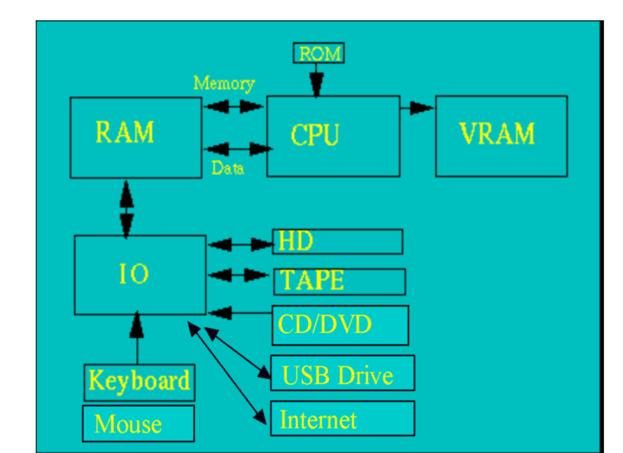

# CPU

- **C**entral **P**rocessing **U**nit

# RAM

- Random Access Memory
- Generally lost when power cycled

# VRAM

- Video RAM
- This is for screen size and color depth

# ROM

- Read Only Memory
- Used for boot

# IO Input/ Output

- IO is through interfaces such as SCSI (Small Computer System Interface)

# USB

- Universal Serial Bus

# HD

- Hard Disk
- For permanent storage

# CDROM

- Compact Disk Read Only Memory

# Operating Systems

- Controls everything in the way the computer works.
- Not specific to a CPU type, but often some OS's are associated with specific CPU

- Windows
- Mac OS
- Fedora Unix
- Android
- Ubuntu
- Raspberry Pi OS

- OS controls IO and memory management (latter is important in multi tasking OS)
- Specific program's implementations are often dependent on OS

# Hard Disk

- Contains the computer's file system
- A **file system** defines how files are named, stored, and retrieved from a storage device.
- **NFC**: Network File System allows connections between different computer systems.

- Smallest thing in a computer is called **bit**
- CPU basically only performs how to perform **AND**, **OR** and **XOR**(exclusive or).
- CPU is a massive collection of **AND** and **OR** gates.
- CPU's only understand *Machine Language*

