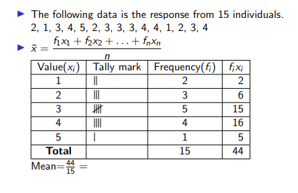
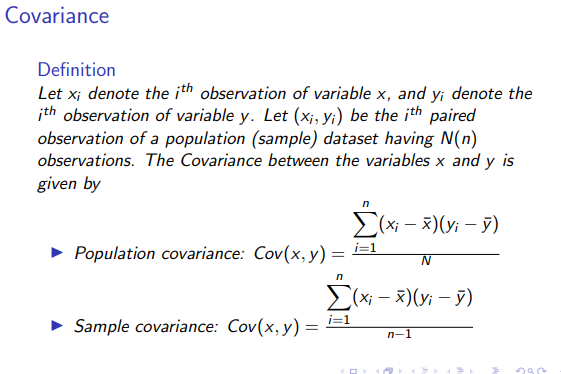

# Statistics Notes

* Statistics is the art of learning from data. It is concerned with the collection of data, their subsequent description, and their analysis which often leads to drawing of conclusions.

## Major Branches of Statistics

### Description

* The part of statistics concerned with the description and summarization of data is called **Descriptive Statistics**.

### Inference

* Part of statistics concerned with the drawing of conclusions from the data is called **Inferential Statistics**

## Population

* The total collection of all elements that we are intrsted in is called a population.

## Sample

* A subgroup of the population that will be studied in detail is called sample.

* A descriptive study may be performed either on a sample or on a population.
* When inference is made about population based on information from sample, the study becomes **inferential**.

## Data

* Data are facts and figures collected, analyzed, and summarized for presentation and interpretation.

* **Each variable have its own column**
* **Each observation have its own row**

***Data are of two types, Categorical and numerical***

## Categorical Variables

* Also called **Qualitative variables**
* Identifies group membership.

## Numerical Variables

* Also called **Quantitative variables**
* Describes numerical properties of cases.
* Have measurement units.

## Time Series

* Data recorded over time

## Timeplot

* Graph of time series showing values in chronological order.

## Cross-Sectional

* Data observed at the same time.

## Scales Of Measurement

* Nominal
* Ordinal
* Interval
* Ratio

## Nominal Scale Of Measurement

* When the data for a variable consists of names or labels used to identify the characteristics of an observation, the scale of measurement is called **Nominal Scale**.
* The main characteristic feature of this scale is that no ordering happens.
* Variables can even be numerically coded like male as 0 and female as 1 or vice-versa and here also we can see that 0<1 is meaningless.

## Ordinal Scale Of Measurement

* This is simply nominal scale of measurement with an added feature that the data can be ordered or ranked meaningfully.
* Ex, Remarks which can include bad<good<excellent<extraordinary

## Interval Scale Of Measurement

* This scale of measurement just consist of ordinal scale with an added feature that the intervals between values can be expressed in terms of fixed unit of measure.
* Ratios have no meaning here because value of zero is arbitrary.
* As values of zero is arbitrary, hence ratios also have no meaning.
* Ex: Consider an AC room where temperature is set at 20deg C and the temperature outside the room is 40deg C. So it would be right to say that diffrence between both is 20deg C, but it is very incorrect to say that outdoors is twice as hot as indoors because we dont know which temperature signifies absolute absence of heat.

## Ratio Scale Of Measurement

* If the data have all the properties of interval data, and the ratio of two values is meaningful, then the scale of measurement is ratio scale.
* Here the knowledge of absolute zero numerical value is known.
* Ex height, weight, age, marks, etc
* All operations like addittion, subtraction, multiplication, division are possible.

## Relative Frequency

* Number of cases/Total number of observation taken

## Pareto Charts

* These are simply bar charts sorted by frequency.
* If categorical variable is ordinal, the bar chart must preserve th ordering.

# Valid Charts Rule

## Area Principle

* **The area occupied by a part of graph should correspond to the amount of data it represents.**
* Hence for a valid bar chart,  all the bars should be of same width.

## Truncated Graphs

* Valid graphs always starts from 0 of y axis, so as to give full information.

## Rounding Off

* As for a valid graph, rounding off is done very carefully. Because if rounding off is done in pie charts uncarefully, then all percentages when added up can add up to more than 100%.

## Mode

* The mode of a categorical variable is the most common category, the category with the highest frequency.

## Bimodal Data

* If two or more categories tie for the highest frequency, the data are said to be **bimodal** (in case of two) or **multimodal** (more than two).

## Median

* ***Firstly put all records in order***.

* If two values come in between, then mean of the two is final median.

## Organizing Discrete Data (Single Value)

* If the data set contains only a small number of distinct, or diffrent values, it is convenient to represent it in a **frequency table**.

## Organizing Continous Data

* Best method of organizing continous data is to split them into diffrent classes. However there are few points that needs to be kept in mind while making classes:

1. **Number of classes**: The appropiate number is subjective choice, the rule of thumb is to have 5 to 20 classes.
2. Each observation must belong to some class and no observation should belong to more than one class.
3. It is common, although not essential to choose class intervals of equal length.

## Some New Terms

1. **Lower Class Limit**: The smallest value that could go in a class.
2. **Upper Class Limit**: The larget value that could go in a class.
3. **Class Width**: The diffrence between lower limit of a class and the lower limit of the next higher class.
4. **Class Mark**: he avaerage of two class limits of a class.
5. ***A class interval contains its left-end but not its right-end boundary point***.

## Stem And Leaf Diag

* This can be understood inly by example itself:

# Descriptive Measures

## Measures Of Central Tendency

* These are measures that indicate the most typical value or canter of a data set.

## Measures Of Dispersion

* These measures indicate the variablity or the spread of a dataset.

## Measures Of Central Tendency

### Mean

* Sample Mean=(x1+x2+x3+....xn)/n
* Population Mean=(x1+x2+x3+....xN)/N

### Mean Of Frequency Table Graph

* Mean=(f1x1+f2x2+....+fnxn)/n

### Mean For Grouped Data

* Mean=(f1m1+f2m2+....+fnmn)/n

* Adding a constant to every value of data shifts mean by (orig mean + constant added)
* Multiplying every value in dataset makes new mean=old mean*(constant/total entries)

* Remember **Sample mean is sensitive to outliers**

## Median

* Mentioned above

* Adding a constant to all entries of data makes new mean constant + old mean
* new median=old median*constant

## Mode

* Mentioned above

## Measures Of Dispersion

* Range
* Variance
* Standard Variance
* Interquatile range

## Range

* The range of a data set is the diffrence between its largest and smallest values.
* **Range is sensitive to outliers**

## Variance

* Adding a constant does not changes variance.
* Multiplying a constant makes new variance as old variance times*c*c
* It has a disadvantage that its unit is not same as that of the units of all entries.

## Standard Deviation

* Adding a constant to all entries does not change the standard deviation.
* Multiplying every data by some constant makes new data's stand deviation equal to c*root(old st deviation)

## Percentiles

* The sample 100p percentile is that data value having the property that at least 100p percent of the data are less than or equal to it and at least 100(1-p) percent of the data values are greater than or equal to it.

### Computing Percentile

1. Arrange the data in increasing order.
2. If np is not an integer, determine the smallest integer value greater than np. The data value in that position is the sample 100p percentile.
3. If np is an integer, then the average of the values in positiond np and np+1 is the sample 100p percentile.

## Quartiles

* The sample 25th percentile is called **first quartile** , the sample 50th percentile is called **second quartile** , the sample 75th percentile is called the **third quartile**.

## The Five Number Summary

* Minimum
* Q1: First quartile or lower quartile
* Q2: Second Quartile of Median
* Q3: Third Quartile or upper quartile
* Maximum

## Interquartile Range (IQR)

* The interquartile range, IQR is the diffrence between the first and third quartiles; that is,

IQR=Q3-Q1

## Contingency Table

* Organizing bivariate data into a two way table is what makes a contingency table.
* If data is ordinal, maintain the order of the variable in the table.

## Row Relative Frequency

## Column Relative Frequency

## Association Between Two Variables

* Association between variables means whether knowing information about one variable provides information about the other variable.
* **If the row relative frequencies (the column relative frequencies) are the same for all rows (columns) , then we say that the two variables are not associated with each other.**
* **Is the row relative frequencies (the column relative frequencies) are diffrent for some rows (some columns) then we say that the two variables are associated with each other**

## Stacked Bar Chart

## Scatter Plot

* A scatter plot is a graph that displays pairs of values as points on a two dimensional plane.

## Tightly Clustered Scatter Plot

## Strength Of Association Between Two Variables

1. Covariance
2. Correlation

## Covariance

* Covariance has a unit which is equal tp unit of x axis*unit of y axis

