# Matplotlib 

Matplotlib is a python library used for graphing things out.


****

```py
import matplotlib.pyplot as plt
```

****

# Line Graph


```py
x=[i for i in range(10)]
y=[i for i in range(10)]

plt.plot(x,y)
plt.show()
```

****

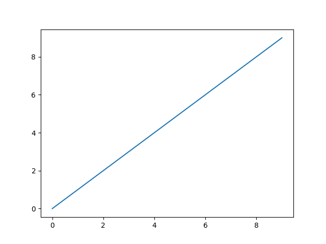

****

## Adding Labels

****

```py
x=[i for i in range(10)]
y=[i for i in range(10)]

plt.plot(x,y)

plt.xlabel('X Axis')
plt.ylabel('Y Axis')

plt.show()
```

****

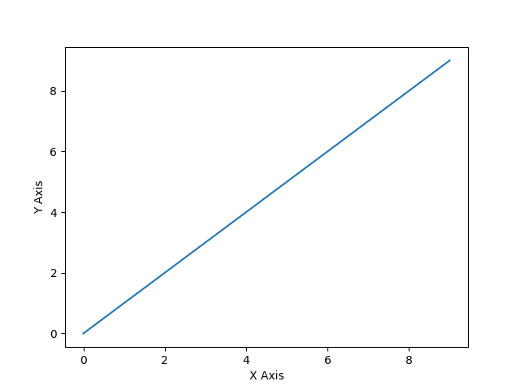

****

## Adding Title

****

```py
x=[i for i in range(10)]
y=[i for i in range(10)]

plt.plot(x,y)

plt.xlabel('X Axis')
plt.ylabel('Y Axis')

plt.title('Graph')

plt.show()
```

****

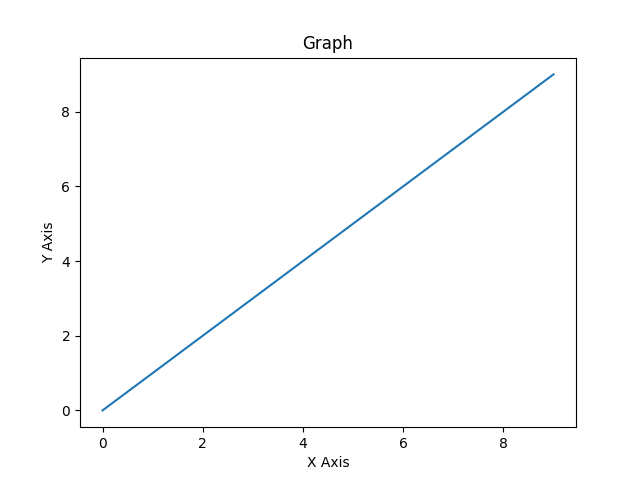

****

## Adding Legends

```py
x=[i for i in range(10)]
y=[i for i in range(10)]

plt.plot(x,y)

plt.legend(['First Graph'],title='Legend')

plt.xlabel('X Axis')
plt.ylabel('Y Axis')

plt.title('Graph')

plt.show()
```

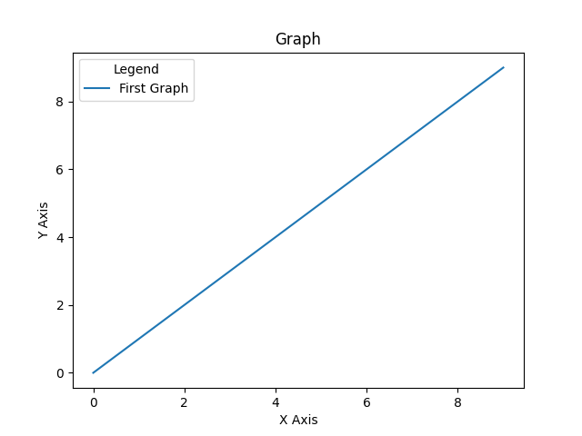

****

## Styling Graphs

****

```py
x=[i for i in range(10)]
y=[i for i in range(10)]

plt.style.use('dark_background')

plt.plot(x,y)

plt.legend(['First Graph'])

plt.xlabel('X Axis')
plt.ylabel('Y Axis')

plt.title('Graph')

plt.show()
```

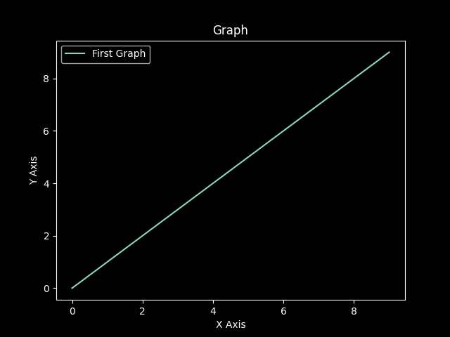


****

## List of Available Styles

****

```py
plt.style.available

#Output: ['Solarize_Light2', '_classic_test_patch', 'bmh', 'classic', 'dark_background', 'fast', 'fivethirtyeight', 'ggplot', 'grayscale', 'seaborn', 'seaborn-bright', 'seaborn-colorblind', 'seaborn-dark', 'seaborn-dark-palette', 'seaborn-darkgrid', 'seaborn-deep', 'seaborn-muted', 'seaborn-notebook', 'seaborn-paper', 'seaborn-pastel', 'seaborn-poster', 'seaborn-talk', 'seaborn-ticks', 'seaborn-white', 'seaborn-whitegrid', 'tableau-colorblind10']
```

****

## Setting Point Styles

****

```py
x=[i for i in range(10)]
y=[i for i in range(10)]

plt.style.use('dark_background')

plt.plot(x,y,'b-o')

plt.legend(['First Graph'])

plt.xlabel('X Axis')
plt.ylabel('Y Axis')

plt.title('Graph')

plt.show()
```

****

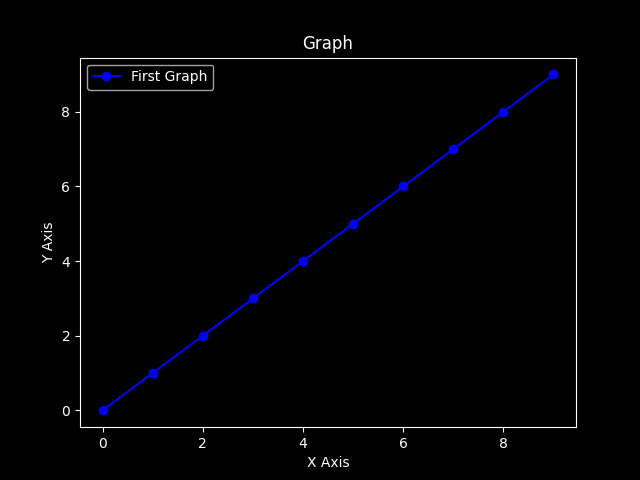

****

## Adding Grids

****

```py
x=[i for i in range(10)]
y=[i for i in range(10)]

plt.style.use('dark_background')

plt.plot(x,y,'b-o')

plt.legend(['First Graph'])

plt.xlabel('X Axis')
plt.ylabel('Y Axis')

plt.title('Graph')

plt.grid()

plt.show()
```

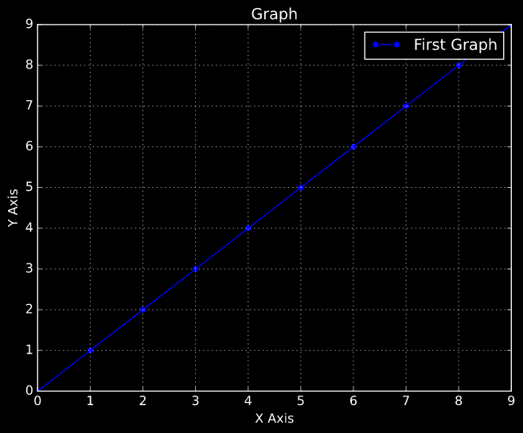

****

## Adding Limits

****

```py
x=[i for i in range(10)]
y=[i for i in range(10)]

plt.style.use('dark_background')

plt.plot(x,y,'b-o')

plt.legend(['First Graph'])

plt.xlabel('X Axis')
plt.ylabel('Y Axis')

plt.xlim(0,5)
plt.ylim(0,5)

plt.title('Graph')

plt.grid()

plt.show()
```

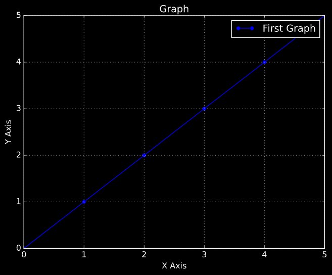

****

## Tight Axis

****

```py
x=[i for i in range(10)]
y=[i for i in range(10)]

plt.style.use('dark_background')

plt.plot(x,y,'b-o')

plt.legend(['First Graph'])

plt.xlabel('X Axis')
plt.ylabel('Y Axis')

plt.title('Graph')

plt.axis('tight')

plt.grid()

plt.show()
```

****


****

## Labelling Points

****

```py
x=[i for i in range(10)]
y=[i for i in range(10)]

plt.style.use('dark_background')

plt.plot(x,y,'b-o')

plt.legend(['First Graph'])

plt.xlabel('X Axis')
plt.ylabel('Y Axis')

plt.annotate('This is mid point',(5,5))

plt.title('Graph')

plt.axis('tight')

plt.grid()

plt.show()
```

****

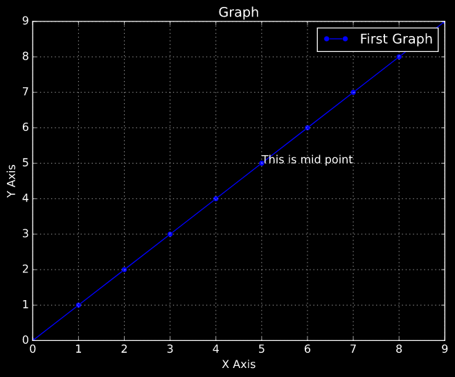

****

## Putting Arrows

**Syntax**
```py
plt.arrow(x,y,x_width,y_width)
```

Example:

```py
x=[i for i in range(10)]
y=[i for i in range(10)]

plt.plot(x,y,'b-o')

plt.legend(['First Graph'])

plt.xlabel('X Axis')
plt.ylabel('Y Axis')

plt.arrow(5,5,2,1,width=.09,color='cyan')

plt.annotate('This is mid point',(7,6.5),color='red')

plt.title('Graph')

plt.axis('tight')

plt.grid()

plt.show()
```

****

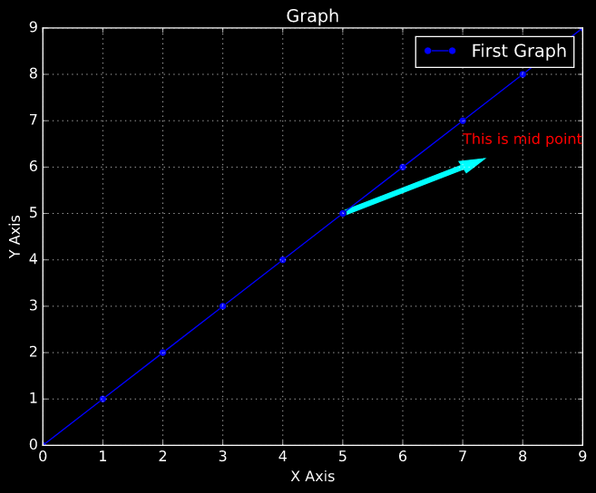

****

# Bar Graph

```py
x=['Sam','Angel','Rahul']
y=[12,13,15]

plt.bar(x,y)

plt.xlabel('Students')
plt.ylabel('Marks')
plt.title('Class')

plt.show()
```
****

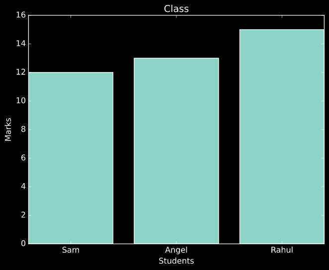

****

## Horizontal Bar Graph

```py
plt.barh(x,y)
plt.show()
```

****

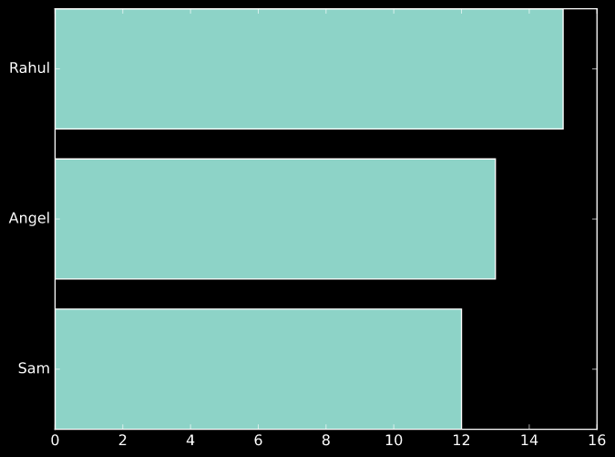

****

# Pie Charts

```py
langs = ['C', 'C++', 'Java', 'Python', 'PHP']
students = [23,17,35,29,12]

plt.style.use('classic')

plt.pie(students,labels=langs,autopct='%1.2f%%')

plt.show()
```

****

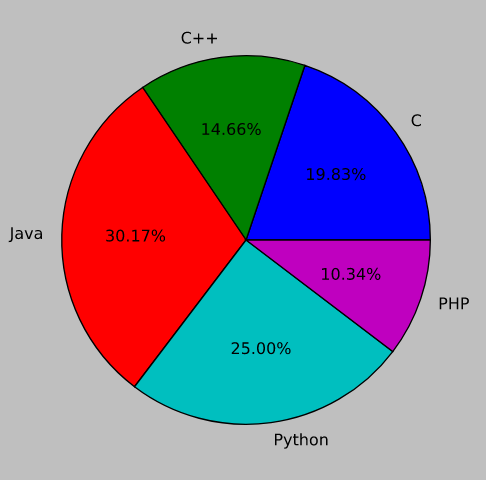

****

## Explode

****

```py
langs = ['C', 'C++', 'Java', 'Python', 'PHP']
students = [23,17,35,29,12]

plt.pie(students,labels=langs,autopct='%1.2f%%',explode=[.2,0,0,0,0])

plt.show()
```

****

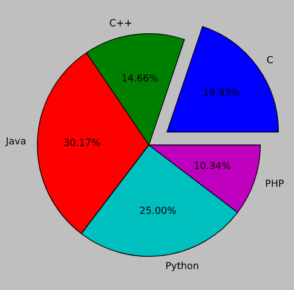

****

## Legends

****

```py
plt.style.use('classic')

langs = ['C', 'C++', 'Java', 'Python', 'PHP']
students = [23,17,35,29,12]

plt.pie(students,labels=langs,autopct='%1.2f%%',explode=[.2,0,0,0,0],shadow=True)

plt.legend()

plt.show()
```

****

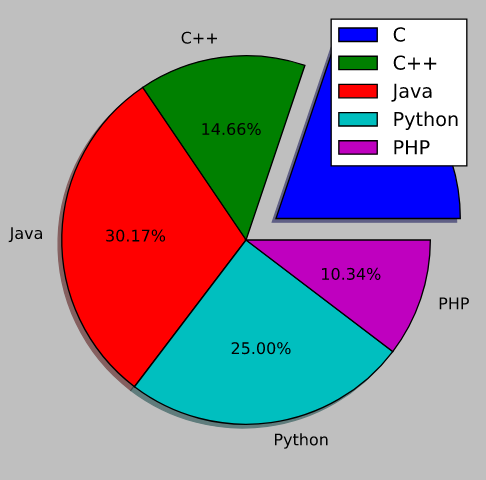

****

 