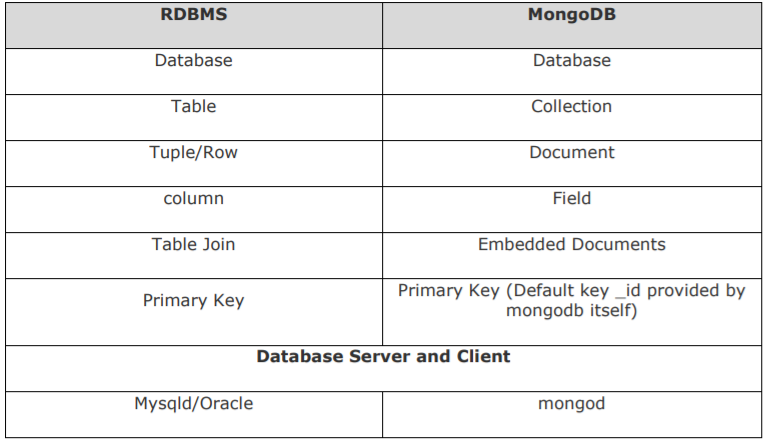

# MongoDB

<hr>


<hr>

- MongoDB is an open-source document database and a leading NoSQL database. MongoDB is written in C++.

<hr>

# Important Terms

<hr>

## Database

<hr>

- Database is a physical container for collections. Each container gets its own set of files on the file system.

<hr>

## Collection

<hr>

- Collection is a group of MongoDB documents. It is the equivalent of RDBMS table. Collection dont enforce a schema.

<hr>

## Document

<hr>

- A document is a set of key-value pairs.

<hr>



<hr>

# MongoDB Syntax

<hr>

## Show All Databases

<hr>

```
show dbs
```

<hr>

## Show Current Database

<hr>

```
db
```

<hr>

## Create Or Switch Database

<hr>

```
use database_name
```

<hr>

## Drop Database

<hr>

```
db.dropDatabase()
```

<hr>

## Create Collection

<hr>

```
db.createCollection('collection_name')
```

<hr>

## Show Collections

<hr>

```
show collections
```

<hr>

## Insert Row

<hr>

```
db.collection_name.insert({title: 'Post One',
  body: 'Body of post one',
  category: 'News',
  tags: ['news', 'events'],
  user: {
    name: 'John Doe',
    status: 'author'
  },
  date: Date()})
```

<hr>

## Insert Multiple Rows

<hr>

```
db.collection_name.insertMany([
  {
    title: 'Post Two',
    body: 'Body of post two',
    category: 'Technology',
    date: Date()
  },
  {
    title: 'Post Three',
    body: 'Body of post three',
    category: 'News',
    date: Date()
  },
  {
    title: 'Post Four',
    body: 'Body of post three',
    category: 'Entertainment',
    date: Date()
  }
])
```

<hr>

## Get All Rows

<hr>

```
db.collection_name.find()
```

<hr>

## Get All Rows Formatted

<hr>

```
db.collection_name.find()pretty()
```

<hr>

## Find Rows

<hr>

```
db.collection_name.find({key: value})
```

<hr>

- The above searching technique would search all rows for the key value pair.

<hr>

## Sort Rows

<hr>

### Ascending Order

<hr>

```
db.collection_name.find().sort({ key_name: 1 }).pretty()
```

<hr>

### Descending Order

<hr>

```
db.collection_name.find().sort({ key_name: -1}).pretty()
```

<hr>

## Count Rows

<hr>

```
db.collection_name.find().count()
```

<hr>

- In order to count rows with a specific key value pair:

<hr>

```
db.collection_name.find({ key_name: value }).count()
```

<hr>

## Limit Rows

<hr>

- In order to get only first n rows of database, use following command:

<hr>

```
db.collection_name.find().limit(n).pretty()
```

<hr>

## Chaining

<hr>

- In order to get first n sorted rows, use the below code:

<hr>

```
db.collection_name
```

<hr>

## Foreach

<hr>

- In order to iterate over all the rows, and to achieve a specific output through this, we use following method:

<hr>

```
db.collection_name.find().forEach(function(row){
  print("First entry: "+row.key)
})
```

<hr>

## Find One Row

<hr>

- In order to find first specific row, with a particular key-value pair, we use following code:

<hr>

```
db.collection_name.findOne({key: value})
```

<hr>

## Find Specific Fields

<hr>

```
db.collection_name.find({ key1: value1}, {key2: value2, key3: valeu3})
```

<hr>

## Update Row

<hr>

- In order to update specific rows, we run following code:

<hr>

```
db.collection_name.update({key1: value1}, {key2: value2, key3: value3,...}, {upsert: true})
```

<hr>

- The above code takes 3 arguments, first one is the key value pair in order to identify the exact row/ rows that have to be updated. The second argument is the key value pairs that the older rows have to be udated with. Thirdly `upsert` means to create a new row if in case we arent able to identify the row that has to be updated.

<hr>

- In order to identify which row has to be updated, `_id*` is the best key value.

<hr>

## Update Specific Field

<hr>

- In order to update specific field/ fields, we give 2 parameters here, first one being the key value pair in order to identify which row has to be updated, second one being the updated key value pair. Suppose here if we givs a key value pair, which does not exists, then a new key value pair would get generated for that.

<hr>

```
db.collection_name.update({key1: value1} {$set: {
  key2: new_value2,
  key3: new_value3
}})
```

<hr>

## Increment Field

<hr>

- In order to increment a particular field, we use following method:

<hr>

```
db.collection_name.update({key1: value1}, {$inc: {
  key2: increment_value
}})
```

<hr>

- Here the first argument is the key value pair i order to identify the row.

<hr>

## Rename Field

<hr>

```
db.collection_name.update({key1: vaule2}, {
  $rename: {
    old_key: new_key
  }
})
```

<hr>

## Delete Row

<hr>

```
db.collection_name.remove(key1: value1)
```

<hr>

## Sub Documents

<hr>

```
db.posts.update({ title: 'Post One' },
{
  $set: {
    comments: [
      {
        body: 'Comment One',
        user: 'Mary Williams',
        date: Date()
      },
      {
        body: 'Comment Two',
        user: 'Harry White',
        date: Date()
      }
    ]
  }
})
```

<hr>

## Find By Element In Array

<hr>

- Now, we wanna have some code in order to find an element in object which is put as value of a key in the object. So in order to do so, we use following method.

<hr>

```
db.collection_name.find({
  key: {
    $eleMatch: {
      key: value
    }
  }
})
```

<hr>

## Add Index

<hr>

```
db.collection_name.createIndex({ title: 'text' })
```

<hr>

## Text Search

<hr>

```
db.collection_name.find({
  $text: {
    $search: "\"Post O\""
    }
})
```

<hr>

## Greater & Less Than

<hr>

```
db.posts.find({ views: { $gt: 2 } })
db.posts.find({ views: { $gte: 7 } })
db.posts.find({ views: { $lt: 7 } })
db.posts.find({ views: { $lte: 7 } })
```

<hr>
