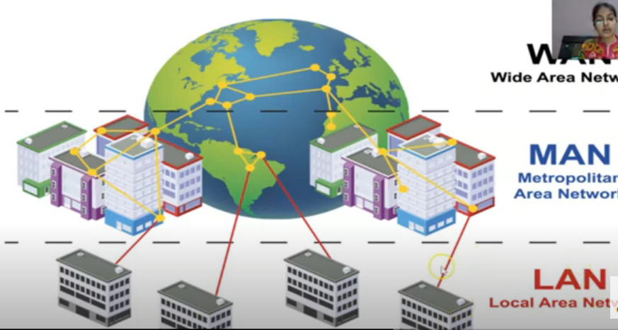

# Computer Networks

* The collection of interconnected computers is called computer network.
* Two computers are said to be connected if they are capable of sharing and exchanging information or resources.

## Advantages

* Resource Sharing
* Reliability
* Cost Effectiveness
* Communication Medium

## Elaborating Every Advantage

### Resource Sharing

Resource sharing means to make all programs, data and peripherals available to anyone on the network irrespective of physical location of the resources and the user.

### Advantages

Reliability means to keep the copy of a file on two or more diffrent machines , so if one of them is unavailable ,then its other copy can be used.

### Cost Factor

Cost factor means it greatly reduces the cost since the resources can be shared.

### Communication Medium

Communication medium one can send messages and whatever the changes at one one end which can be immediately noticed at another end.

## Types Of Network

### PAN

A Personal Area Network is a computyer network organized around an individual person. I generally covers a range of less than 10 mts . PAN's can be constructed with cables or wirelessly.

### LAN

* A Local Area Network (LAN)
* Its a network that is confined to a relatively small area.
* It is generally limited to a geographic area such as achool or lab or office building.
* It is generally privately owned networks over a distance of not more than 5 Kms.
* A hardware as well as software resources are shared through LAN.
* In LAN , one computer is designated as **file server** , which stores all the software that can be shared by computers attached to a network.
* Computers connected to the server are called **workstation** .

### MAN

* MAN is the networks cover of a group of nearby corporate offices or a city and might be either private or public.
* I refers to the **network that is spread over an area as big as city**

### WAN

* These are the networks spread over large diatances , say across countries or even continents through cabling or satellite uplinks are called WAN.
* It can be a group of LAN's that are spread across several locations and connected together.
* It facilitate fast and efficient exchange of information at lesser cost and higher speeds.
* The largest WAN is **Internet**

### Comparision Between LAN And WAN

| LAN                                | WAN                                       |
| ---------------------------------- | ----------------------------------------- |
| It is spread over a small area.    | It is spread over a very large area       |
| It usually costs less to set it up | It costs much to set it up.               |
| It is usually a single network     | It is usually a network of many networks. |

## Switching Techniques

* Switching techniques are used for transmitting data across networks.

### Types Of Circuit Switching

### Circuit Switching

* In the circuit switching technique , firstly a **complete end to end transmission path between the source and the destination computer is established** and **then message is transmitted through the path**.
* The main advantage of this technique is **guaranteed delivery of the message**. Mostly used for voice communication.

### Packet Switching

* In this technique **fixed size of packets** can be transmitted across network.

### Message Switching

* In message switching technique , **no physical path is established between sender and receiver in advance**.
* Thus each node receives the entire message , stores it entirely in disk , and transmits the message to the next node if it is not the destination node.
* This type of network is also called  **Store -and-forward** network.

## Comparision Between Switching Technique

| Criteria                           | Circuit Switching | Packet Switching           | Message Switching    |
| ---------------------------------- | ----------------- | -------------------------- | -------------------- |
| **Path established in advance**    | YES               | NO                         | NO                   |
| **Store and Forward Technique**    | NO                | YES(Stored in main menory) | YES (Stored in Disk) |
| **Message followsmultiple routes** | NO                | YES                        | YES                  |
| **Block Size**                     | No Block Size     | No Limit on BLock          | Limit on Block Size  |

## Data Communication Technologies

* Channel
* Bandwidth
* Data Transfer Rate

### Channel

* Channel is the medium used to carry information or data from one point to another.
* Physical medium like cables over which the information is exchanged is called **channel**.

### Bandwidth

* Data transfer rates that can be supported by a network is called its bandwidth.
* Bandwidth is directly proportional to the amount of data transmitted or received per unit time.
* Example ,it takes more bandwidth to download an image file in 1 sec than to download a page of text in 1 sec.
* Large sound files , vedios , animated mivies requires more bandwidth.
* High bandwidth channels are called **broadband channels**.
* Low bandwidth channels are called **narrowband channels**.
* Bandwidth refers tot the diffrence between highest and lowest frequencies of a transmission channel.
* It is the range of frequencies contained in a composite signal or the range of frequencies a channel can pass.
* It is measured as:
> * Hz
> * KHz
> * MHz

### Data Transfer Rate

* It identifies the number of data elements (bits) sent in 1 sec.
* The data transfer rate represents the amount of data transferred per second by a communication channel or a computing or a storage device.
* Data Transfer rate is measured in units of bits per seconds (bps) , Bps(Bytes per second)
* When applied to data rate , the multiplexer prefixer: 'kilo' , 'mega' , 'tera' etc..
* Kbps
* Gbps
* Tbps

## Transmission Media

* Transmission media is the medium over the messages are transmitted.
* A communication channel is also called as **medium**.
* Diffrent media have diffrent properties and is used in diffrent environments for various purposes.

### Twisted Pair Cable

* It consists of two identical 1 mm thick copper wires insulated and twisted together. The twisted pair cables are twisted in order to reduce crosstalk and electromagnetic induction.

#### Advantages

* It is easy to install and maintain.
* It is very inexpensive.

#### Disadvantages

* It is incapable to carry a signal over long distances without the use of repeaters.
* Due to low bandwidth , these are **not suitable for broadband applications**.

### Co-axial Cables

* It consists of a solid wire core surrounded by one or more foil or braided wire shields , each part is separated from other by some kind of plastic insulator. It is mostly used in cable wires.

#### Advantage

* Data transmission rate is better than twisted pair cables.
* It provides a cheap means of transporting multi-channel television signals around metropolitan areas.

#### Disadvantages

* Expensive than twisted pair cables.
* Difficult to manage and reconfigure.

### Optical Fibre

* An optical fibre consists of thin glass fibres that can carry information in the form of visible light.

#### Advantages

* Transmit data over long distances with high security.
* Data transmission speed is high.
* Provides better noise immunity.
* Bandwidth is up to 10 Gbps.

#### Disadvantages

* Expensive as compared to other guided media.
* Needs special while installation.

### Infrared

* The infrared light **transmits data through the air and can propagate throughout a room , but will not penetrate walls**. It is secure medium of signal transmission .The infrared transmission has become common in TV remotes ,automotive garage doors ,wireless speakers etc.

### Radio Waves

* Radio waves are electromagnetic waves with a wavelength between 0.5cm and 30,000m. The transmission making use of radio frequencies is termed as radio-wave transmission.

#### Advantages

* Radio wave transmission offer mobility.
* It ischeaper than laying cables and fibres.
* It offers ease of communication over difficult terrain.

#### Disadvantages

* Radio wave communication is insecure communication.
* Radio wave propagation is susceptible to weather effects like rains , thunder storms etc. 

### Microwave

* The microwave transmission is a line of sight transmission. Microwave signals travel at a higher frequency than radio waves and are popularly used for transmitting data over long distances.

#### Advantages

* It is cheaper than lying cable or fiber.
* It hasthe ability to communicate over oceans.

### Satellite Link

* The satellite transmission is also kind of line of sight transmission that is used to transmit signals throughout the world.

#### Advantages

* Area covered is quite large.
* No line of sight restrictions such as natural mountains ,tall buildings ,towers.
* Earth station which receives the signals can be in fixed position or relatively mobile.

#### Disadvantages

* Very expensive as compared to other transmission mediums.
* Installation is extremely complex.
* Signals sent to the stations can be tampered by external interference.

## Network Devices

Networking hardware ,also known as network equipments or computer networking devices , are **electronic devices which are required for communication and interaction between devices on a computer network.**

* Ethernet Card
* Modem
* Bridge
* WiFi Card
* Hub
* Repeater
* Gateway
* RJ 45
* Switch
* Router

### Modem

* Full form: **Modulator** or **Demodulator**.
* A modem is a hardware device that allows a computer or another devoce ,such as router or switch ,to connect to the Internet.
* As we know **phone lines work on Analog signals ,while computer works on digital signal**.
* So the role of modem is to **convert Digital Signal to Analog** so that it can be carried by telephone lines and other side it convert **Analog signal to Digital Signals** ,so that it can be carried by computer.

### Types Of Modems

#### Internal Modems

The modems that are fixed within the computer.

#### External Modems

The modems that are connected externally to a computer as other peripherals are connected.

### RJ-45

* RJ in RJ-45 stands for **Registered Jack** .It is a standard type of physical connector for network cables.
* RJ-45 connectors are most commonly seen with ethernet cables feature small plastic plugs on each end that are inserted into the RJ-45 jacks of Ethernat devices.

### Ethernet Card

* It is also known as **NIC** (**Network Interface Card**)
* It is a device that is ***attached to each of the workstations and the server and helps the workstations establish all important connection the network**.
* It contain RJ-45 slot to connect ethernet cable with RJ-45 connector.
* Each NIC attached to workstation has a unique number identifying it , known as MAC address.
* Also known as **Network Interface Unit**.

### Hub

* A hub is a hardware device **used to connect several computers together**.
* A hub is a networking device **with multiple ports** that are used for connecting multiple computers or segments of LAN together.
* **Sends the incomming data to all destinations**

/149238278-56a1ad765f9b58b7d0c19fe8.jpg)

### Types of Hub

#### Active Hub

It **amplifies the signal as it moves from one connected device to another**. These are like repeaters to extend the length of a network.

#### Passive Hub

It **allows the signal to pass from one computer to another ,without any change**.

### Working Of Hub

* Hub is a multiplort repeater , which **broadcasts all information to all other ports**. Hence it is called as **Non intelligent ** or **dumb device**.
* Causes unnecessary traffic.
* Hub can send or receive information , but it can not do both at a same time.

### Switch

A switch is responsible for filtering , i.e. **transforming data in a specific way and for forwarding packets between LAN Segments**

### Working Of A Switch

* A switch has same job as that of a hub's , i.e. to connect multiple computers . But ,**a switch is a smart device**.
* It **can identify the intended destination** and send the information only to the target computers.
* No unnecessary traffic generated.
* Can send and receive information at the same time.

### Repeater

* A repeater is a device that **amplifies and restore the signals for long distance transmission**.

### Bridge

* A bridge is a device that lets you **link two networks together**.
* Bridges are smart enough to know which commputers are on side of bridge , so they only allow those messages that need to get to the other side to cross the bridge.
* Bridges can **handle networks that follow same protocol**

### Router

* A device that works like a bridge but can **handle diffrent protocols**.
* The router is responsible for forwarding data from one network to a diffrent network.
* If the destination is unknown to a router , it sends the traffic to another router which knows the destination.

### Gateway

* A gateway is a device that connects **dissimilar networks**.
* It establishes an intelligent between a local area networks with completely diffrent structures.

### WiFi Card

* Similar to Ethernet card , but **it allows our computers to connect with other devices without wire , i.e. for wireless connectivity**.
* It may be internal or external with built-in wireless radio and antenna the most common Wi-Fi card used in desktop computer are PCI express Wi-Fi card made it fit the PCI express card slot on the motherboard.
* It **allows to connect our device to hotspot available**.
* Advantage is that it allows computer to become part of a network without being physically connected through wire and can be placed anywhere.

## Network Protocols

* In network there are variety of computers connected to each other and share data in many ways.
* ***For interaction among these , some rules aare applied like how and when a device can send and receive data , how to send the data packet and how to receive**.
* Some network protocols are given below:-

* HTTP
* FTP
* SMTP
* TCP/IP
* PPP
* IMAP
* POP3
* VoIP
* TELNET

### HTTP

**H**: Hyper 
**T**: Text 
**T**: Transfer 
**P**: Protocol 

* HTTP is a protocol for the transfer of information on the internet and the World Wide Web.
* HTTP is a request /response standard between a client and a aserver. A client is the end-user ; the server is the web site.

### FTP

**F**: File 
**T**: Transfer 
**P**: Protocol 

* FTP is the simplest and the most secure way to exchange files over the internet. The objectives of FTP are:
* TO promote sharing of files(Computer programs and /or data)
* TO encourage indirect or implicit use of remote computers.
* To sheild a user from the variations in a file storage systems among diffrent hosts.

### TCP/IP

**T**: Transmission 
**C**: Control 
**P**: Protocol 
**I**: Internet 
**P**: Protocol  

* TCP **is responsible for verifying the correct delivery of data from client to server**. Data can be lost in the intermediate network. TCP adds support to detect errors or the lost data and to detect errors or lost data and to trigger retransmission until the data is correctly and completely received.
* TCP is a **connection-oriented protocol** that is first the connection is established between the sender and the receiver.
* TCP divides the large packets to to transmit into smaller data packets called **Datagrams**.
* At the receiving end , it also reassemble the packet from original message.

* IP is responsible for moving packet of data from node to node. IP forwards each packet based on a four byte destination address(the IP number) .The Internet authorities assign ranges of numbers to different organisations .The organisations assign groups of their numbers to departments. IP operates on gateway machines that move data from department to organization to region and then around the world.
* Internet protocol is responsible for providing address of each packet is a sign with destination IP address.

### PPP

* PPP stands for **Point to Point Protocol**.
* It is a communication protocol of the data link layer that is **used to transmit multi-protocol data between two directly connected point-to-point computers**.
* It is a byte oriented protocol that is widely used in broadband communications having heavy loads and high speeds.

### SMTP

* SMTP stands for **Simple Mail Transfer Protocol**.
* SMTP is a set of communication guidelines that allows software to transmit an electronic mail over the internet.
* It is a program **used for sending messages to computer users based on email address.**

### IMAP

* IMAP stands for **Internet Message Acccess Protocol**.
* It is a standard protocol for accessing E-Mail from local server.
* It is a **client/server protocol in which E-Mail is received and held for the user by Internet server**.
* As this requires only a small data transfer , this works well over a slow connection such as Modem.
* Only if a user requests to read a specific message , then it will be downloaded from the server.

### POP3

* POP3 stands for **Post Office Protocol**.
* **It is a client-server protocol in which email is received and held for you by your internet server**
* Periodically you check yourmailbox on the server and download any email probably using POP3.
* I also **allows to download the received messages on the local machine using tool like Outlook so that user can read them even when they are not connected to the internet**. The user choose to leave copies of the mails on the server as well.
* The **advantage is that once messagesare downloaded , the user can cut the Internet Connection** and read his.her Email at own leisure without incurring further communication cost.

### VoIP

* VoIP stands for Voice over Internet Protocol.
* It is a protocol **that enables voice communication over the internet through** the compression of voice into data packets that can be effectively transmitted over data network and then convert back into voice at receiving end.
* It uses packet switching (store and forward).
* It is an elternative to traditional telephone Network.

### Remote Login

* Remote login is a network application that **permits a user sitting at a diffrent location to work on a specific program on another computer**.
* The user need ID of that computer generated by remote login application.
* It is done only when both PC's are connected to the Internet.
* The main programs are : Telnet , AnDesk , Teamviewer.

## Telnet

* Telnet is one of the earliest remote protocols on the internet.
* Through telnet , **an administrator or another user can access someone as computer remotely**.
* On the web , HTTP and FTP protocols allow you to request specific files from remote computers but not actually be log on as a user of that computer.
* With telnet , you logon as a regular user with whatever priveleges you may have been granted to specific application on and data on that computer.

## Network Topologies

* Topology is an **art of connecting diffrent computers in a network.**
* The way in which the computers / devices are physically interconnected to form a network is called a **Topology**.

## Types Of Topology

* Ring Topology
* Bus Topology
* Star Topology
* Tree Topology

### Bus Topology

* In a bus topology , **all the nodes are connected to a main cable called backbone.
* If any node has to send some information to any other node , it **sends the signal to the backbone**.
* The signal travels through the entire length of the backbone and is received by the node for which it is intended.

#### Advantages

* It is easy to install
* It requires less cable length and hence , it is cost effective.
* Failure of a node does not affect the network.

#### Disadvantages

* In case of a cable fault , the entire network goes down.
* At a time , only one node can transmit data.

### Star Topology

* In a Star topology , **each node is directly connected to a hub / switch**.
* I any node has to send any information to any other node , it sends the signal to the hub/switch.
* The star topology uses a separate cable for each node / workstation. The cable connects the node to a central device typically a HUB.

#### Advantages

* It is easy to install.
* It is easy to diagnose the fault in Star Topology.
* If one link fails , the network can still function.

#### Disadvantages

* Failure of Hub / Switch leads to failure of entire network.
* It requires more cable length as compared to Bus Topology.

### Ring Topology

* In a ring topology , **every computer is connected to the next computer in the ring and each transmit the signal , what it receives from the previous computer**. The messages flow around the ring in one direction.

#### Advantages

* Easy to install and configure.
* Easy to detect the problem.
* All the data flows in one direction , reducing the chance of the packet collission.

#### Disadvantages

* All the data being transferref over the network must pass through each workstation on the network , which can make it slower than a star topology.
* The entire network will be impacted if one workstation shuts down.

### Tree Topology

* Tree topology is **a combination of Bus and Star Topology**
* It is usedto combine multiple star topologies.

#### Advantages

* It offers easy way of network expansion.
* Even if one network fails , the other network remains connected and working.

## Network Security

* Network Security is any activity designed to protect the usability and integrity of your network and data.
* It includes both Hardware and SOftware Technologies.
* Effective network security manages access to the network. It targets a variety of threats and stops them from entering or spreading on your network.
* It includes measures to make  sure that only legal or authorized users and programs gain access to information resources like databases.

### Threats To Network Security

* Virus
* Worms
* Trojan Horse
* Spams

### Protection Methods

* Authentication
* Authorization
* Encryption
* Biometric System
* Firewall

### Authentication

* Authentication is the process of verifying who a user is.

### Authorization

* Authorization is the process of varifying what they have access to.

### Encryption

* Conversion of the form of data from one form to another form.

### Biometric System

* Involves unique aspect for person's identification such as Finger-prints , retinal patterns etc to establish his/her identity.

### Firewall

* A system designed to **prevent unauthorized access to or from a private network**.

### VIRUS

/what-is-a-computer-virus-a82f9491ad3644b89446d45233b57761.jpg)

**V**: Vital 
**I**: Information 
**R**: Resource 
**U**: Under 
**S**: Seize

* Viruses are malacious code / programs that causes damage to data and files on a system.
* **Virus attach itself to program or file so that it can spread from one computer to another.**

#### Damages Caused By Viruses

* Damage or delete files
* Slows down your system.
* Screen FLickering

### Prevention From Virus

* Install and update **Antivirus** software.
* Dont download or open email from any unknown sender.
* Dont click on link in email which is from unknown sources.
* Disconnect the internet , if you are anyway.
* Disable cookies , if possible.

### Worm

* A worm is **  self replicating program which eats up the entire disk space or memory**.
* A worm keeps on creating its copies until all the disk space or memory is free.