# HTML Notes

<hr>


<hr>

# HTML5 Basics

<hr>

- All html documents start with `<!DOCTYPE html>`.
- Used to tell browsers that this is an HTML document.
- Then HTML document itself begins with `<html>` and end with `</html>`
- HTML is not case sensitive

<hr>

```html
<!DOCTYPE html>
<html>
  <body>
    <h1></h1>
    <p></p>
  </body>
</html>
```

<hr>

# Headings

<hr>

- To put headings in html file, we use `<h1>`, `</h1>`.
- In HTML we have 6 heading tags, from `<h1>` till `<h6>`.
- As we go on from `<h1>` till `<h6>`, the size of headings keep on reducing.
- Headings are important because browsers look onto this headings in order to index our webpage in websites.

<hr>

```html
<!DOCTYPE hml>
<html>
  <body>
    <h1>HTML Notes</h1>
  </body>
</html>
```

<hr>


<hr>

# Custom Heading Size

<hr>

- In order to make bigger/smaller headings as per your needs, we use `font-size` property inside `style`.
- It is convenient to mention size in pixels, so we use pixels.

<hr>

```html
<!DOCTYPE html>
<html>
  <body>
    <h1 style="font-size: 60px">Custom Heading Size</h1>
  </body>
</html>
```

<hr>

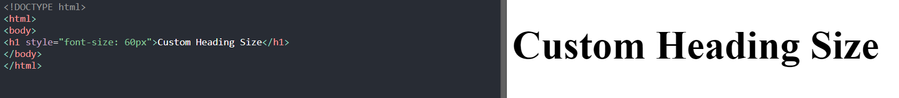

<hr>

# Paragraphs

<hr>

- Paragraphs are written in HTML with the help of `<p>`, `</p>`.

<hr>

```html
<!DOCTYPE html>
<html>
  <body>
    <h1>HTML Notes</html>
    <p>These are my html notes</p>
  </body>
</html>
```

<hr>

# Custom Paragraph Structure

<hr>

- In HTML, suppose if we break line, without `<br>` tag, or put more than 1 space between words, then browsers, by default would ignore all the extra spaces or line breaks.
- Hence in order to over this problem, we use `<pre>` tag.

<hr>

```html
<!DOCTYPE html>
<html>
  <body>
    <h1>My Poem</h1>
    <pre>
I am a poet
I write poem
This is my poem
Hope you liked
    </pre>
  </body>
</html>
```

<hr>

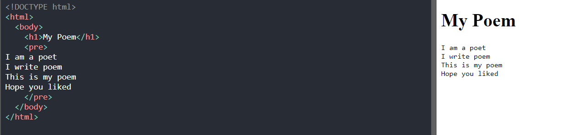

<hr>

# Links

<hr>

- We put links in html with the help of anchor tag, ie `<a>`,`</a>`
- We use `<a href="URL" target="_blank">` in order to open link in a new window or a new tab.
- We use `<a href="URL" target="_self">` in order to open link in the same window or the same tab.

<hr>

```html
<!DOCTYPE html>
<html>
  <body>
    <h1>HTML Notes</h1>
    <p>These are my html notes</p>
    <a href="https://www.w3schools.com" target="_self">This is a link</a>
  </body>
</html>
```

<hr>


<hr>

# Images

<hr>

- In order to insert images, we use ``.
- Instead of URL, we xan also put relative pah of images that sre on the working directory.
- We can also put GIF's URL in place of image's URL
- Use `float:right/left` inside style in ``'s `style=` to align image to left or right side.

<hr>

```html
<!DOCTYPE html>
<html>
  <body>
    <h1>HTML Images</h1>
    <p>Here is an html logo</p>
    
  </body>
</html>
```

<hr>

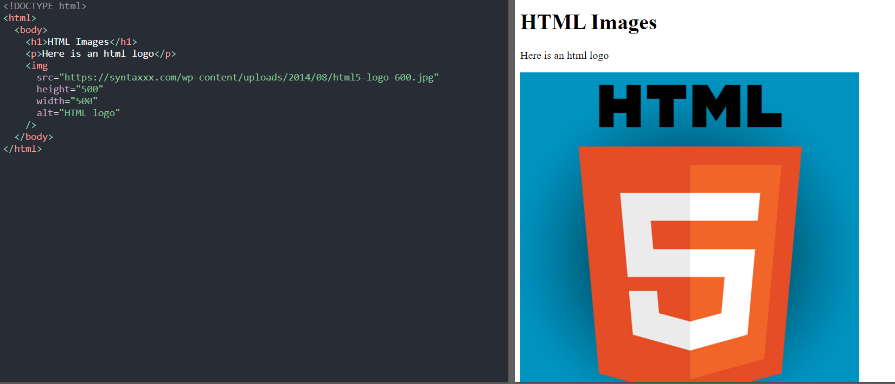

<hr>

# Break Line

<hr>

- To jump to next line, we use break tag, ie `<br>`.

<hr>

```html
<!DOCTYPE html>
<html>
  <body>
    <h1>HTML Images</h1>
    <p>Here is an html logo</p>
    <br /><br /><br />
    
  </body>
</html>
```

<hr>

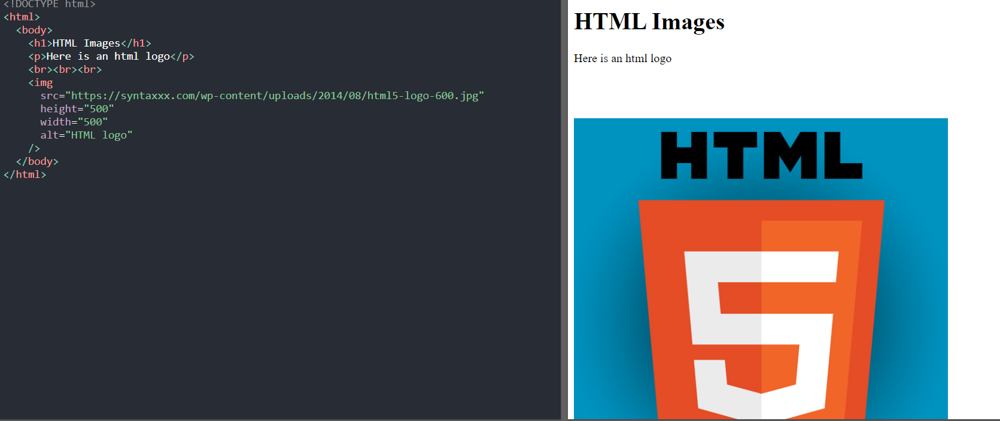

# Empty HTML Tags

<hr>

- HTML tags with only opening tag (no closing tag)

<hr>

# Language And Country Code

<hr>

- In order to assist search engine to figure out the language of out website, there is a lang property to specify language, and to specify country, we have country property. Example of syntaxes of these are shown below.

<hr>

```html
<!DOCTYPE html>
<html lang="en-In">
  <!--en is the language and In is to specify India-->
</html>
```

<hr>

# Title property

<hr>

- Title property is used to give some extra detail to an element while cursor is hovered over there.

<hr>

```html
<!DOCTYPE html>
<html>
  <body>
    <h1 title="This is heading title">Heading</h1>
    <p title="This is para title">
      Please hover the mouse over to h1 as well as this para to notice
      functioning of the title property.
    </p>
  </body>
</html>
```

<hr>

# Style property

<hr>

- Style property is used to add styles to an element such as color, size, fonts etc.
- It's format is like:- `<tagname style="property:value">`.

<hr>

```html
<!DOCTYPE html>
<html>
  <body>
    <h1>Styles in HTML</h1>
    <p style="color:red">This is my red colored paragraph</p>
  </body>
</html>
```

<hr>

# Background Color

<hr>

- In order to put a background color, we use CSS `background-color` property.

<hr>

```html
<!DOCTYPE html>
<html>
  <body style="background-color: gold">
    <h1>Background Color Demo</h1>
  </body>
</html>
```

<hr>

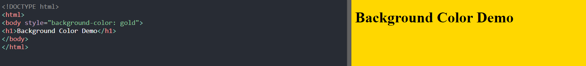

<hr>

# Text Color

<hr>

- In order to put colorful texts in websites, we use `color` property.

<hr>

```html
<!DOCTYPE html>
<html>
  <body>
    <h1 style="color: red">Text Coloring</h1>
    <p style="color:blue">This is an example of text coloring</p>
  </body>
</html>
```

<hr>

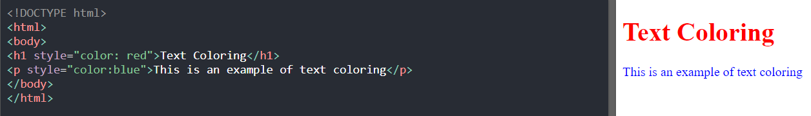

<hr>

# Font Family

<hr>

- In order to customize the font syles, we use `font-family` property.

<hr>

```html
<!DOCTYPE html>
<html>
  <body>
    <h1 style="font-family:georgia">Font Family Customization</h1>
    <p style="font-family:helvetica">
      This font is written in helvetica font style, while the title is in
      georgia.
    </p>
  </body>
</html>
```

<hr>

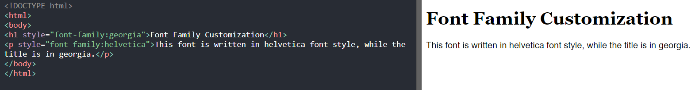

<hr>

# Text Alignment

<hr>

- In order to align texts, we use `text-align` property.

<hr>

```html
<!DOCTYPE html>
<html>
  <body>
    <h1 style="text-align:center">Text Alignment</h1>
    <p style="text-align:center">
      Sunt et magna irure proident sint quis ut laborum velit laborum dolor
      deserunt culpa. Nostrud do cupidatat id tempor do do voluptate enim
      occaecat labore. Ullamco sit officia officia mollit ut sint ipsum.
    </p>
  </body>
</html>
```

<hr>

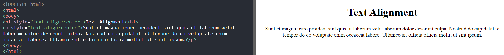

<hr>

# Bold Texts

<hr>

- To mske html texts bold, we use `<b>`, `</b>` property.

<hr>

```html
<!DOCTYPE html>
<html>
  <body>
    <p>
      <b
        >Minim irure officia ut sint commodo cillum consectetur elit aliqua aute
        dolor. Nulla amet eiusmod laboris duis do ea cupidatat proident ad. Duis
        est voluptate amet ad aliqua ad laboris laborum aliquip ea
        exercitation.</b
      >
    </p>
  </body>
</html>
```

<hr>

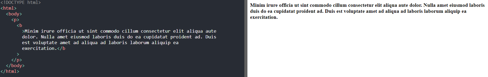

<hr>

# Strong Texts

<hr>

- Strong texts are also generally bold, but to browser, they signify that the content is somewhat related to that keyword, which improves indexing. Strong texts are made with the help of `<strong>`, `</strong>` tags.

<hr>

```html
<!DOCTYPE html>
<html>
  <body>
    <h1>Strong Tag</h1>
    <p>
      This paragraph is written to show that <strong>Strong Tag</strong> is now
      wriiten in string text format.
    </p>
  </body>
</html>
```

<hr>

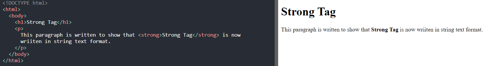

<hr>

# Italic Texts

<hr>

- Italic texts are made wit the help of `<i>`, `</i>` tags.

<hr>

```html
<!DOCTYPE html>
<html>
  <body>
    <h1>Italics</h1>
    <p>
      <i
        >Est fugiat cillum in culpa quis commodo in incididunt amet sit. Non
        exercitation nisi fugiat reprehenderit consequat qui aliquip labore
        nulla nostrud occaecat enim nulla pariatur. Officia ea quis
        reprehenderit nisi. Dolor laborum sit non proident commodo. Anim
        occaecat magna enim aute ea duis veniam duis ex minim et incididunt.</i
      >
    </p>
  </body>
</html>
```

<hr>


<hr>

# Emphasized Text

<hr>

- Used to emphasize a text, the contents in this style are generally put up in italics. This is achieved using `<em>`, `</em>` tags.

<hr>

```html
<!DOCTYPE html>
<html>
  <body>
    <h1>Emphasizing Text</h1>
    <p>
      <em
        >Non sunt nulla aliqua enim tempor exercitation cillum irure do sit.
        Consectetur commodo consequat tempor officia enim ut. Ut cupidatat elit
        occaecat non consequat est.</em
      >
    </p>
  </body>
</html>
```

<hr>

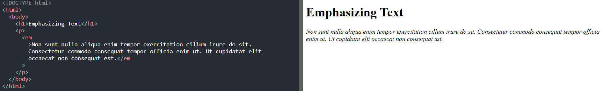

<hr>

# Smaller Text

<hr>

- Used in order to write small texts. This is achieved using `<small>`, `</small>` property.

<hr>

```html
<!DOCTYPE html>
<html>
  <body>
    <h1>Small Texts</h1>
    <p>
      <small
        >Ad commodo reprehenderit velit excepteur nisi. Cupidatat minim tempor
        reprehenderit reprehenderit nulla nostrud non pariatur ea. Ut labore et
        pariatur sit. Quis laboris do amet et mollit ea consequat exercitation
        labore est pariatur.</small
      >
      This is the normal size
    </p>
  </body>
</html>
```

<hr>

# Marked Texts

<hr>

- This property is used to highlight the text. This is usually achieved with the help of `<mark>`, `</mark>` property.

<hr>

```html
<!DOCTYPE html>
<html>
  <body>
    <h1>Highted Texts</h1>
    <p>
      Duis enim duis qui nulla tempor.
      <mark
        >Adipisicing eu eiusmod Lorem culpa aliquip est tempor est proident
        esse</mark
      >. Dolor ea voluptate magna nisi cupidatat elit incididunt.
    </p>
  </body>
</html>
```

<hr>

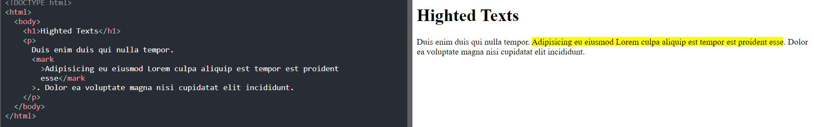

<hr>

# Deleted Text

<hr>

- In order to show that some text has been deleted, we use delete tag ie `<del>`, `</del>`.
- It simply strikes through the line.

<hr>

```html
<!DOCTYPE html>
<html>
  <body>
    <h1>Deleted Text</h1>
    <p>
      Sint ad elit non et
      <del>irure ex ipsum ex est sit deserunt amet est. Cillum pariatur</del>
      minim ad excepteur eiusmod dolor magna ut occaecat est veniam et quis
      consequat. Aliquip laboris dolore commodo irure laboris quis ex esse
      laborum laboris esse anim cupidatat adipisicing.
    </p>
  </body>
</html>
```

<hr>

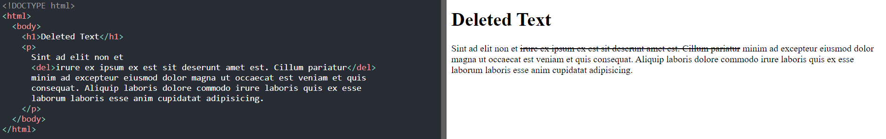

<hr>

# Inserted Text

<hr>

- Inserted text is simply underlined text. This is achieved by `<ins>`, `</ins>` property.

<hr>

```html
<!DOCTYPE html>
<html>
  <body>
    <h1>Text Insertion</h1>
    <p>
      Sunt Lorem excepteur culpa officia ea
      <ins>ut sit dolor laborum. Laborum id dolore id irure nisi et enim</ins>
      deserunt. Ullamco officia cillum incididunt elit esse. Duis nisi ad
      adipisicing dolor sunt duis sunt in eu non deserunt. Ullamco nostrud
      laboris ad do in non dolor cupidatat quis excepteur quis sit.
    </p>
  </body>
</html>
```

<hr>

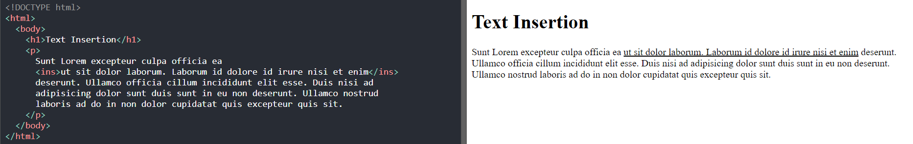

<hr>

# Subscript Text

<hr>

- Used to enter text as a subscript. For this, `<sub>`,`</sub>` properties are used.

<hr>

```html
<!DOCTYPE html>
<html>
  <body>
    <h1>Subscript Txt</h1>
    <p>
      Aliquip eiusmod fugiat reprehenderit
      <sub
        >ullamco ut culpa sint velit fugiat. Ut non ipsum incididunt velit</sub
      >
      exercitation ad ea aliquip nostrud consectetur veniam mollit proident
      ullamco. Eu aliquip elit sunt do ipsum laboris ipsum.
    </p>
  </body>
</html>
```

<hr>

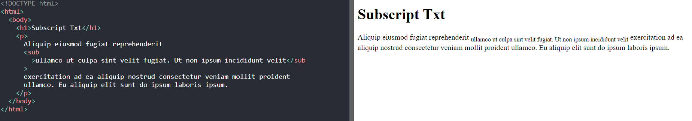

<hr>

# Superscript Element

<hr>

- Used to put superscript texts in websites. For this, we use `<sup>`, `</sup>`.

<hr>

```html
<!DOCTYPE html>
<html>
  <body>
    <h1>Subscript Txt</h1>
    <p>
      Aliquip eiusmod fugiat reprehenderit
      <sup
        >ullamco ut culpa sint velit fugiat. Ut non ipsum incididunt velit</sup
      >
      exercitation ad ea aliquip nostrud consectetur veniam mollit proident
      ullamco. Eu aliquip elit sunt do ipsum laboris ipsum.
    </p>
  </body>
</html>
```

<hr>

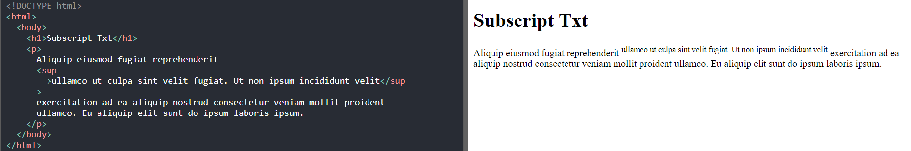

<hr>

# Blockquote

<hr>

- Copying information from any other source as i is would make browsers feel that our website is just a scam.
- Hence in order to copy data from any other source and put that on out website, we use blockquotes, ie `<blockquote>`, `</blockquote>`.

<hr>

```html
<!DOCTYPE html>
<html>
  <body>
    <p>Here is a quote from WWF's website:</p>
    <blockquote cite="http://www.worldwildlife.org/who/index.html">
      For 50 years, WWF has been protecting the future of nature. The world's
      leading conservation organization, WWF works in 100 countries and is
      supported by 1.2 million members in the United States and close to 5
      million globally.
    </blockquote>
  </body>
</html>
```

<hr>

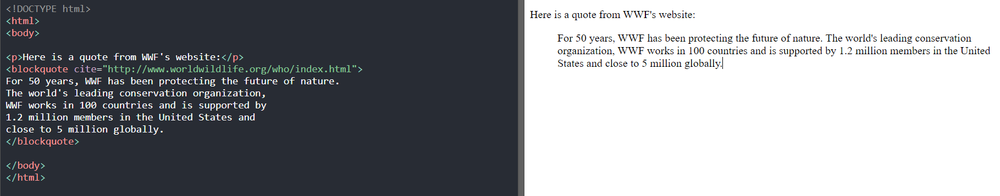

<hr>

# ShortQuotation

<hr>

- In order to write some short quotations, we use `<q>`, `</q>` property.
- It simply put quotation inside double inverted commas.

<hr>

```html
<!DOCTYPE html>
<html>
  <body>
    <p>Browsers usually insert quotation marks around the q element.</p>

    <p>
      WWF's goal is to:
      <q>Build a future where people live in harmony with nature.</q>
    </p>
  </body>
</html>
```

<hr>

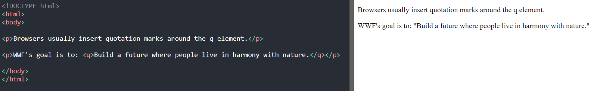

<hr>

# Abbreviations

<hr>

- In HTML we have tags like `<abbr title="full form">`,`</abbr>` for indicating what our abbreviations actually mean.

<hr>

```html
<!DOCTYPE html>
<html>
  <body>
    <p>
      The <abbr title="World Health Organization">WHO</abbr> was founded in
      1948.
    </p>

    <p>
      Marking up abbreviations can give useful information to browsers,
      translation systems and search-engines.
    </p>
  </body>
</html>
```

<hr>

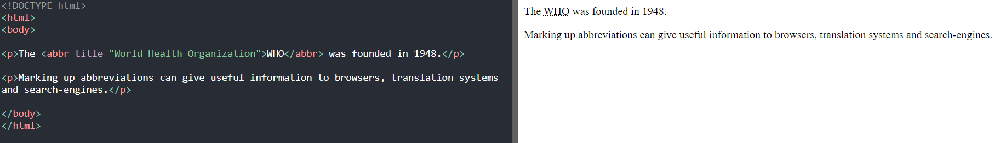

<hr>

# Address

<hr>

- In order to specify address in HTML, we use `<address>`, `</address>` tag.
- It simply writes our address in italics.

<hr>

```html
<!DOCTYPE html>
<html>
  <body>
    <p>
      The HTML address element defines contact information (author/owner) of a
      document or article.
    </p>

    <address>
      Written by John Doe.<br />
      Visit us at:<br />
      Example.com<br />
      Box 564, Disneyland<br />
      USA
    </address>
  </body>
</html>
```

<hr>

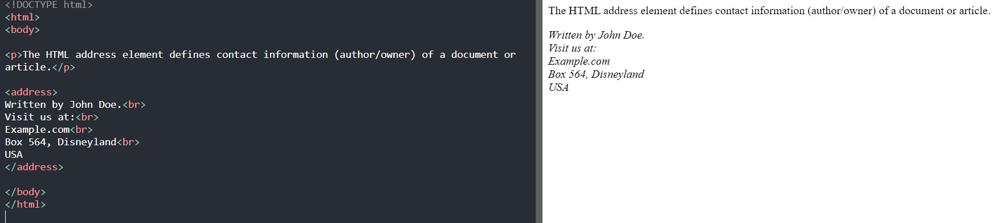

<hr>

# Cite

<hr>

- In order to write titles of books, movies, or anything, we use `<title>`, `</title>` tags.

<hr>

```html
<!DOCTYPE html>
<html>
  <body>
    <p>The HTML cite element defines the title of a work.</p>
    <p>Browsers usually display cite elements in italic.</p>

    
    <p><cite>The Scream</cite> by Edvard Munch. Painted in 1893.</p>
  </body>
</html>
```

<hr>

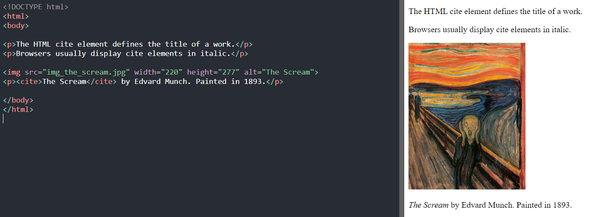

<hr>

# Comments In HTML

<hr>

- Commenting is done in HTML by writing our comments between `<--` and `-->`.

<hr>

# Borders

<hr>

- In order to put border with custom colors, we use the `border: width solid color` property.

<hr>

```html
<!DOCTYPE html>
<html>
  <body>
    <h1 style="border: 2px solid blue">Borders</h1>
    <p style="border: 3px solid green">
      Ipsum ea id aliqua sit tempor velit pariatur non velit consectetur minim.
      Proident ex elit exercitation velit duis occaecat labore anim id sint elit
      qui do. Veniam do pariatur culpa sit ex culpa fugiat ipsum eiusmod. Dolor
      sit reprehenderit consequat consectetur exercitation minim consequat
      proident occaecat.
    </p>
  </body>
</html>
```

<hr>

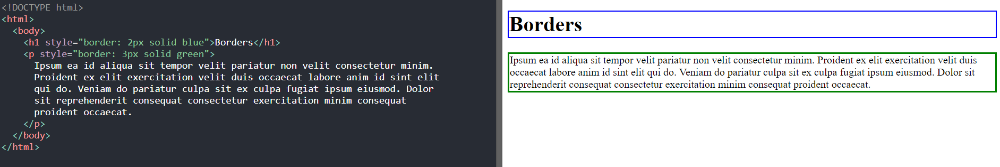

<hr>

# Bookmarks

<hr>

- In order to jump from one content to another in that same webpage, we use bookmarks.
- For this we give `id` to HTML element, and in anchor tag, we write as follows: `<a href="#id">Text</a>`.

<hr>

```html
<!DOCTYPE html>
<html>
  <body>
    <h1>Bookmarks</h1>
    <p>
      <a href="#lst">Last Para</a>Commodo laboris sit commodo in nostrud velit
      consectetur dolore exercitation sit laboris qui sint dolor.<br />Duis in
      fugiat ad culpa.<br />Et aliqua exercitation ex officia.<br />Exercitation
      sint labore consequat exercitation cupidatat ex id nisi aliquip.<br />Velit
      irure et deserunt eu ex consequat elit quis ex excepteur ea incididunt
      est.Consectetur laboris elit irure aliquip sunt aute qui aliqua anim qui
      ipsum.<br />Est sint ea sint nostrud exercitation esse.<br />Esse
      cupidatat veniam sunt Lorem in.<br />Fugiat cupidatat velit labore a
      officia sunt voluptate est velit irure velit laboris et in ad.
    </p>
    <p id="lst">
      Officia deserunt incididunt non velit.<br />Dolor culpa mollit aute ea
      esse eiusmod nisi nisi adipisicing.<br />Fugiat anim fugiat commodo nisi
      ad fugiat et qui.<br />Ex in fugiat tempor commodo est aliquip dolore.<br />Magna
      veniam anim nisi duis voluptate eiusmod id occaecat.
    </p>
  </body>
</html>
```

<hr>

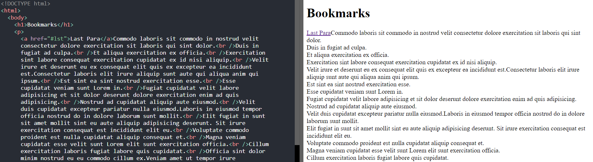

<hr>

# Background Image In Paragraphs

<hr>

- In order to put background images in paragraps, we use `<div style="background-image: url('URL')">`.

<hr>

```html
<!DOCTYPE html>
<html>
  <body>
    <h1>HTML</h1>
    <div
      style="background-image: url('https://sm.mashable.com/mashable_in/seo/default/8-years-of-the-avengers-how-joss-whedons-risk-became-crucial_5z9w.jpg')"
    >
      <p>
        Esse ea eiusmod dolore ullamco enim aute deserunt ad. Veniam laboris
        amet laboris non consectetur ad pariatur voluptate labore. Nisi officia
        fugiat enim anim laboris est culpa deserunt. Aliqua aliquip do nisi
        velit minim ipsum non occaecat excepteur in. Laborum nisi consequat sint
        ut pariatur magna tempor aute adipisicing sit.Amet cupidatat amet
        proident non ipsum quis ut duis consectetur laboris magna minim commodo.
        Magna minim aliqua occ
      </p>
    </div>
  </body>
</html>
```

<hr>

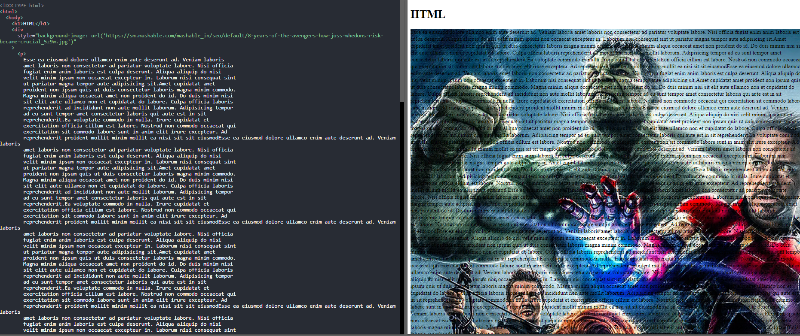

<hr>

# Background Image In Window

<hr>

```html
<!DOCTYPE html>
<html>
  <body
    style="background-image: url('https://wallpaperaccess.com/full/13453.jpg')"
  >
    <h1>HTML</h1>
    <p>
      Veniam Lorem aliquip irure non sit irure anim.<br />Ut laboris tempor
      consectetur id dolore.<br />Dolore esse dolore occaecat commodo dolor
      deserunt sit qui culpa incididunt.<br />Culpa irure esse sit quis sit
      pariatur id pariatur excepteur veniam.<br />Culpa proident quis sunt
      aliqua eiusmod laboris.<br />Cupidatat culpa aliquip mollit veniam anim
      ipsum duis id elit minim et officia.<br />Ut sunt elit eu Non laboris
      cupidatat deserunt consectetur.
    </p>
  </body>
</html>
```

<hr>

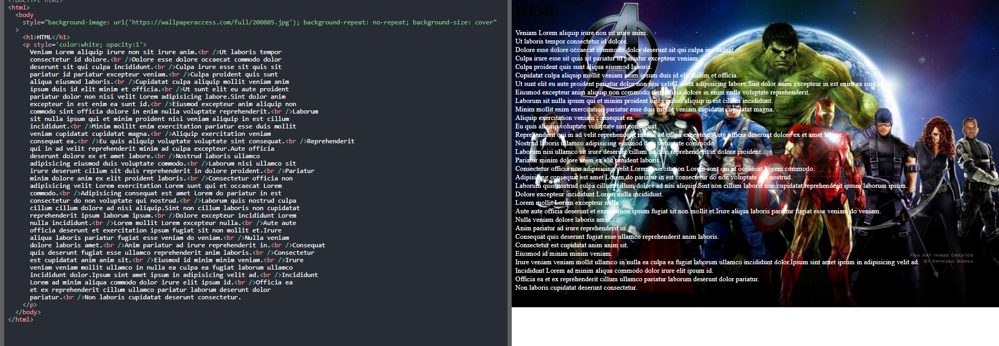

<hr>

# Image Repeat And Cover

<hr>

- If image is smaller than window, then usually it gets repeated.
- In order to stop it repeat, we use `background-repeat: no-repeat` and `background-size: cover` property.

<hr>

## Before

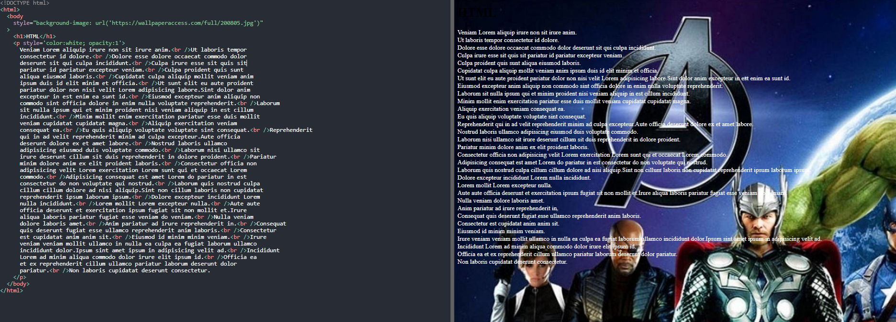

<hr>

## After Using Property

<hr>

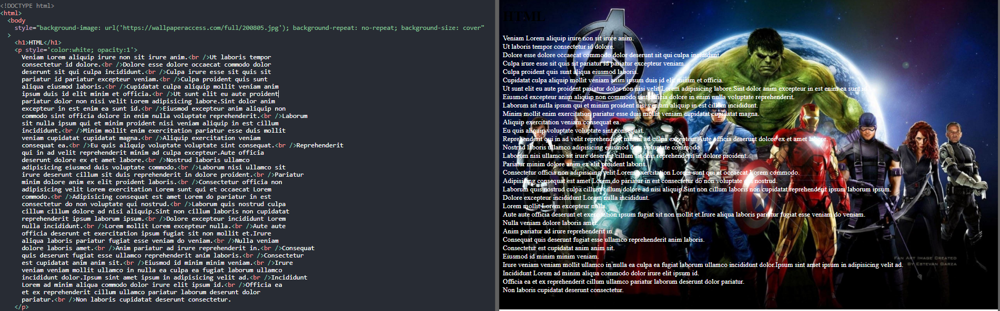

<hr>

- But even after using `background-size: cover`, on resizing the window, image will refuse to cover the entire element. Hence in this situation we use ``background-size: 100% 100%`

<hr>

# Tables

<hr>

```html
<!DOCTYPE html>
<html>
  <body>
    <h1>Table</h1>
    <style>
      table,
      th,
      td {
        border: 1px solid blue;
      }
    </style>
    <table style="width: 100%">
      <tr>
        <th>Firstname</th>
        <th>Lastname</th>
        <th>Age</th>
      </tr>
      <tr>
        <td>Jill</td>
        <td>Smith</td>
        <td>50</td>
      </tr>
      <tr>
        <td>Eve</td>
        <td>Jackson</td>
        <td>94</td>
      </tr>
    </table>
  </body>
</html>
```
