<h1 align="center"> JavaScript Notes</h1>

<hr>

<p align="center"></p>

<hr>

# Data Types

<hr>

- In JavaScript, we have seven types of data types:

<hr>

- `undefined`
- `null`
- `boolean`
- `string` ==> Can be surrounded by either `" "` or `' '` or ` ` \` `. ==> Important
- `symbol`
- `number`
- `object`

<hr>

# Hello World Program

<hr>

```js
<!DOCTYPE html>
<html lang="en">
  <head>
    <meta charset="UTF-8" />
    <meta http-equiv="X-UA-Compatible" content="IE=edge" />
    <meta name="viewport" content="width=device-width, initial-scale=1.0" />
    <title>Document</title>
  </head>
  <body>
    <h1>JavaScript Tutorial</h1>
    <script>
      alert("Hello World");
    </script>
  </body>
</html>
```

<hr>

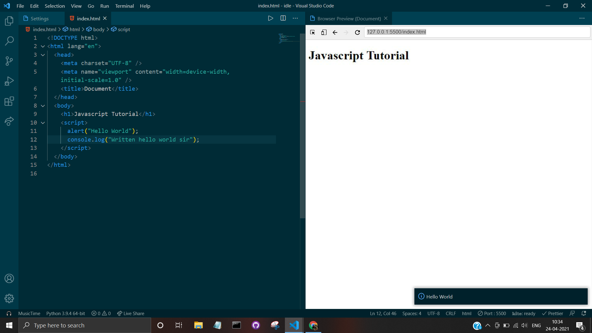

<hr>

<p align="center"></p>

<hr>

- If the JavaScript program is written in another js file, then we need not start coding js code inside `<script>`, `</script>`. Just put `<script src="path">`, `</script>`.

<hr>

# Async And Defer

<hr>

- Now, when we use `<script src="path">`, `</script>`, then there are two ways in which we can ask browser to load our html file.

- **Async**: Async is the default method for browsers. In this method, browsers firstly try reading code line by line and when it reaches script tag, then it downloads that js file and reads through that. So if our js file calls an element that is below `<script></script>`, then browser gives error saying that ie does not know about existence of this element.
- _Syntax_: `<script src="path"></script>`

- **Defer**: Now suppose if we want browsers to read through full code and then run, in this case we use defer.
- _Syntax_: `<script defer src="path"></script>`

<hr>

# Printing In Console

<hr>

- Firstly go to the google browser, `Inspect>Console`.

<hr>

```js
<!DOCTYPE html>
<html lang="en">
  <head>
    <meta charset="UTF-8" />
    <meta name="viewport" content="width=device-width, initial-scale=1.0" />
    <title>Document</title>
  </head>
  <body>
    <h1>JavaScript Tutorial</h1>
    <script>
      alert("Hello World");
      console.log("Written hello world sir");
    </script>
  </body>
</html>
```

<hr>

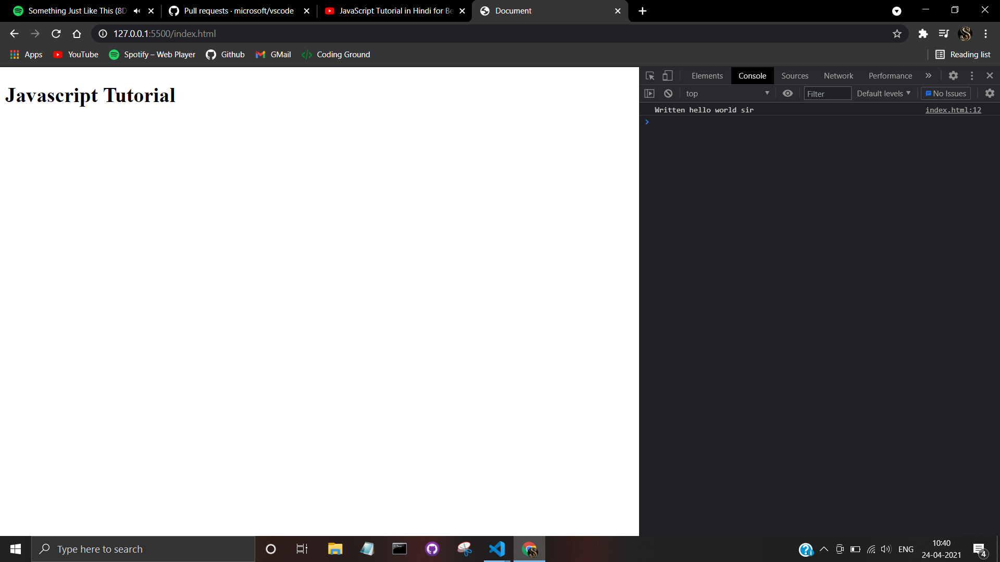

<hr>

# Defining Variables In JavaScript

<hr>

- Before giving value to a variable, we always need to declare it.

<hr>

```js
var a;
a = 5;
//Or
let a = 5;
//Or
let a;
a = 5;
//Or
const a = 5; //Now value of a can be never changed as const==constant
alert(a);
```

<hr>

# var/ let Difference

<hr>

- The main difference `var` and `let` keword is that **var allows a variable declaration multiple times** while **let allows variable declaration only once**.

<hr>

```js
let a = "Sam";
let a = "Angel";
```

<hr>

- The above code would result in an error.

<hr>

```js
var a = "Sam";
var a = "Angel";
```

<hr>

- This code wont result in error.

<hr>

- But still, the following thing could be done even after using `let`, without any error:

<hr>

```js
let a = "Sam";
a = "Angel";
```

<hr>

- Another main difference `var` and `let` keyword is that the **scope of `let` is only limited to block** while the **scope of `var` is global.**.
- `Block Scope` is the part of code inside `{` and `}`.

<hr>

```js
if (5 < 6) {
  let a = 6;
  console.log(`Value of a in block scope is= ${a}`);
}
console.log(`Value of a in global scope is= ${a}`);
```

<hr>

- Above code **would produce an error** that a is **not defined**.
- But in above code **no error would occur** if we **replace `let` by `var`**

<hr>

# const Keyword

<hr>

- `const` keyword is used when we wanna keep a check on a variable and prevent its value from being reassigned.
- There is a tradition of having name of variable which are constant throughout in capitals.

<hr>

```js
const a = 10;
a = 20;
```

<hr>

- Above code would produce an error as we are trying to reassign the value of a whichis against the rule of `const`.
- We can **update an array** even when **it is constant**. Ex:

<hr>

```js
const a = [1, 2, 3];
a[0] = 2;
a[1] = 3;
a[2] = 4;
console.log(a);
```

<hr>

- Output of above code is simple going to be `[2, 3, 4]`.

<hr>

# Freezing Objects

<hr>

- As seen above, even though we put `const` in the array, but still we were able to mutate its value. In order to make it strict not to update/ change value of a specified variable, we use `Object.freeze(variable)` property.

<hr>

```js
const a = [1, 2, 3];
a[0] = 2;
a[1] = 3;
a[2] = 4;
console.log(a);
```

<hr>

- Output of above code is going to be `[1, 2, 3]`.

<hr>

# Comments In JavaScript

<hr>

- Single line comments in JavaScript starts with `//`.
- Multi line comments in JavaScript start with `/*` and ends with `*/`.

<hr>

**Note**

<hr>

- `let x;` is a correct JavaScript variable initialising process. Here if we dont assign x a value after putting this step, then on calling for x in console, we would get its value as `undefined`.
- In JavaScript, `x=x+y` can also be written as `x+=y` just like that in python.
- The output of the following code:-

<hr>

```js
let x = 5;
let y = "5";
console.log(x + y);
```

<hr>

- would be `'55'`, a feature of JavaScript.
- If we want to increase an int number by 1, then here are all he ways to do so:

<hr>

```js
let x = 2;
x = x + 1;
//Or
x += 1;
//Or
x++;
```

<hr>

- All pluses in above code can be replaced by `-` if we wanna subtract 1 from variable.
- In JavaScript, strings can be written inside either double quotes, or single quotes.
- Using backlash can tell browser to ignore the comming quote to recognise as the ending quote.

<hr>

```js
str = "Sam's";
```

<hr>

- Boolean variables can be sored in the following manner:

<hr>

```js
x = 5 > 3;
alert(x);
```

<hr>

- Bollean values:- `true`, `false`.
- In VSCode, do `Ctrl`+`/` in order to comment line in fastest possible way.
- To put output in new line, we have `'\n'` while to put strings in new line in window, we have `<br>` in midst of string.
- Declaring a global variable twice (ie putting `let` for same global variable twice) is wrong.

<hr>

# Getting Type

<hr>

In order to get the type of an object in JavaScript, we use `typeof` function.

<hr>

```js
let x = typeof 1;
console.log(x);
```

<hr>

# Printing Multiple type Data

<hr>

```js
x = 5;
console.log(`The value of x is ${x}`); //NO QUOTES USED!
alert(`The value of x is ${x}`);
```

<hr>

# Equal to Operator

<hr>

- Firstly there is an `=` operator which is used to put the value of the RHS to LHS.
- Then we have an `==` operator which is used to check wether the value of RHS and LHS are same.(**Type can be diffrent**).

`5==5` -> `true`<br>
`6==5` -> `false`<br>
`5=="5"` -> **_true_**

- Now comes `===` operator which is used to check wether type and value of LHS and RHS are equal.

`5==5` -> `true`<br>
`'5'==5` -> `false`<br>

<hr>

# Not Equal to Operator

<hr>

- Here firsty comes the `!=` operator which is used to check wether the vale of LHS and RHS are unequal or not.

<hr>

`5!=5` -> `false`<br>
`5!='5'` -> `false`<br>
`6!=5` -> `true`

<hr>

- Now comes the `!==` operator which is used to check wether RHS and LHS have unequal value or unequal datatype. (**Are really diffrent or not**)

<hr>

`5!==5` -> `false`<br>
`5!=="5"` -> `true`<br>
5!=="6" -> `true`

<hr>

# AND Operator

<hr>

- In JavaScript, `&&` is the AND operator.

<hr>
# OR Operator

<hr>

- In JavaScript, `||` is used as an OR operator.

<hr>

# NOT Operator

<hr>

- In JavaScript, `!` is used as a NOT operator, ie, gives false if true comes, and vice-versa.

<hr>

# Conditionals

<hr>

```js
let age = 14;

if (age < 18) {
  alert("Sorry sir, but you are not allowed to have vaccine.");
} else if (age == 18) {
  //Multiple conditional
  alert("You are exactly 18, let me ask once about you.");
} else {
  alert("Sir, you are eligible to have vaccine.");
}
```

<hr>

# Switch Operator

<hr>

- Switch operator is used when there is a need to write multiple if, else if statements in order to check is value and type of a variable is really equal to another specified value.
- Hence syntax is that we start with `switch (variable)`, and then write `case value:` where this statement is similar to `if(variable===value)` and then in the next line, we write our process that has to get executed if this condition is met.
- `break` is necessary to be written because we would want the if-else code to get terminated when any one of the mentioned equality is met. Hence as switch statements are similar to if and not else if, hence to terminate this code execution, we want break statements.
- `default` is used for the case if variable is not strictly equal to any of the values mentioned. So in this case code inside the default is executed.

<hr>

```js
let age = 18;
switch (age) {
  case 18: //if(age===18){}
    alert("You re exactly 18");
    break; //Compulsory
  case 17: //if(age===17){}
    alert("You are exactly 17");
    break;
  default:
    alert("Your age is neither 17 nor 18"); //Similar to else statement
}
```

<hr>

- Please take a look at the code given below:

<hr>

```js
let age = 19;
switch (age) {
  case 17:
  case 18:
  case 19:
  case 20:
    console.log("You are a teenager.");
    break;
  default:
    console.log("You are not a teenager.");
}
```

<hr>

- In the aboce code, we needed to have same output for multiple equality conditions, hence in this case we used to above syntax to have our requirenments met.

<hr>

# Remainder Operator

<hr>

- In order to find the remainder of division of num1 and num2, we use the `%` operator.

<hr>

```js
remainder = num1 % num2;
```

<hr>

# Shortcut Calculation Methods

<hr>

- If we ever wanna do `a=a+5`, then in this case we can write this directly as `a+=5`.
- If we we wanna do `a=a-5`, then we can write this directly as `a-=5`.
- If we wanna do `a=a*5`, then we directly write as `a*=5`.
- If we ever wanna do `a=a/5`, then we can write directly as `a/=5`.

<hr>

# Escape Characters

<hr>

- Suppose if we wanna declare following string: `var = "This is an example of "DOUBLE QUOTES" inside "DOUBLE QUOTES""`, then in this case first `"` would close at `"` of `"DOUBLE`.
- Hence in order to mention browser to neglect following double quote, we use the escape character `\`.
- Hence the above line can be correctl written as `var = "This is an example of \"DOUBLE QUOTES\" inside \"DOUBLE QUOTES\""`.

<hr>

- `\n` is used to leave a line blank.
- `\t` is used to have a tab space.

- We put break statement because if we wont put that, then switch statement has a prperty that it would directly execute all code line below that, which are under rest of switch statements, without noticing wether the switch statement has approved or disapproved the condition fulfillment.

<hr>

# Ternary Operator

<hr>

- In order to write `if-else` conditions in just a single line, we use ternary opertor.
- Syntax:

<hr>

```js
condition ? statement - true - code : statement - false - code;
```

<hr>

```js
function check_equal(a, b) {
  return a === b ? true : false;
}
```

<hr>

- We can also use multiple ternary operators through following way:

<hr>

```js
let num = 00;
var b = num > 0 ? "Positive" : num < 0 ? "Negative" : "Zero";
console.log(b);
```

<hr>

# While Loop

<hr>

```js
let counter = 0;
while (counter <= 10) {
  document.write("Sam");
  counter += 1;
}
```

<hr>

# Do-While

<hr>

- While loop has speciality that firstly it checks wether condition is satisfied or not, and if the condition gets satisfied, then only would it allow any iteration/looping.
- But suppose if we ever want to run loop once no matter if condition has been satisfied or not, and then after running loop once it should continue only if condition gets satisfied, then to achieve this, we use do-while statement.

<hr>

```js
document.write(
  "While loop running once even though it has not fulfilled condition<br>"
);
counter = 10;
do {
  document.write("Running");
} while (counter <= 5);
```

<hr>

# For Loop

<hr>

- For loop in JavaScript works a bit diffrently than other languages.
- Refer the below code and its explanation given below code:-

<hr>

```js
for (let counter = 1; counter <= 15; counter += 1) {
  document.write(`${counter})Running for loop<br>`);
}
```

<hr>

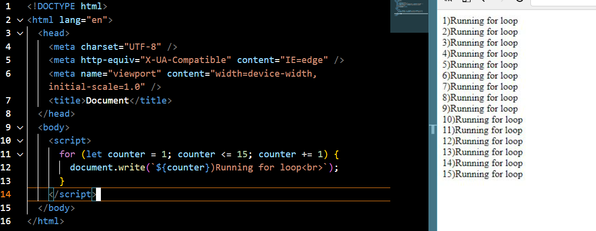

<hr>

- What for loop in JavaScript does is that it asks all variables that are needed to stop for loop and code related to that variable to be written inside for loop's parenthesis only.
- Now after this what JavaScript does is that in the first iteration, it reads only `let counter=1;` code and `counter<=15;` code and ignores the `counter+=1` code.
- Then on the subsequent iterations, it firstly reads `counter+=1` code followed by `counter<=15` code and ignores the `counter=1;` code for rest of ts iterations.

<hr>

# Break

<hr>

<p align="center"></p>

<hr>

- `break` statemet in JavaScript is used in order to get out of the current loop when a certain condition is met.
- We use `break outer` (After naming 1st for as outer by: `outer: for(;;){}`) if we are in a for loop which is also in a for loop, and inside the 2nd for loop we write break in order to break the outer for loop , not the 2nd for.

<hr>

```js
for (counter = 1; counter <= 15; counter += 1) {
  document.write(`<br>${counter}) Running for loop`);
  if (counter === 5) {
    document.write("<br>Condition inside if is met, putting break statement");
    break;
  }
}
document.write("<br>Loop has ended.");
```

<hr>

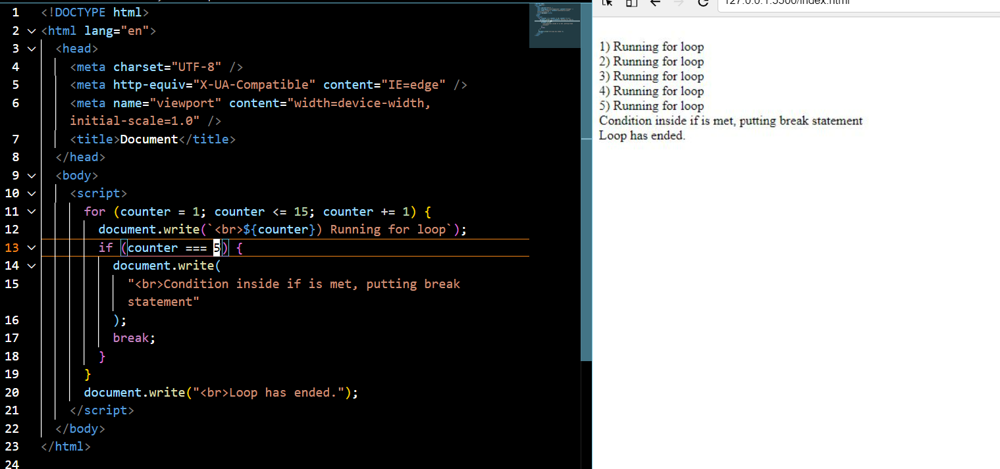

<hr>

# Continue

<hr>

- If we ever wanna jump onto next iteration stopping the currently going iteration, then we use `continue` statement.
- - We use `continue outer` (After naming 1st for as outer by: `outer: for(;;){}`) if we are in a for loop which is also in a for loop, and inside the 2nd for loop we write continue in order to continue the outer for loop , not the 2nd for.

<hr>

```js
for (let counter = 1; counter <= 15; counter += 1) {
  if (counter === 5) {
    document.write("<br>Condition met, executing continue statement");
    continue;
  }
  document.write(`<br>Present iteration=${counter}`);
}
```

<hr>

# Alert, Prompt, Confirm

<hr>

- In order to interact with the user, we use `alert`, `prompt`, `confirm`.

<hr>

- `alert()`:- Shows a message.
- `prompt()`:- Shows a message, input text. It return a text if Ok is pressed, and null if Cancel button or Esc is clicked.
- `confirm()`:- Shows a message, confirm with `Ok` or `Cancel`. Returns `true` or `false` ('false` with Esc or Cancel).

<hr>

**Note**: Unless and until the user does not interacts and give required response to these popups, he won't be able to interact with the rest of the window.

<hr>

# Alert

<hr>

```js
alert("Welcome to Paul Classes");
document.write("<h1>Paul Classes</h1>");
```

<hr>


<hr>

# Prompt

<hr>

```js
name = prompt("Please enter your name: ", "Sam Varghese"); //prompt(question, default value)
document.write(`Welcome Master ${name}`);
```

<hr>

# Confirm

<hr>

```js
response = confirm("Are you sure you wanna load this malacious website?");
if (response) {
  document.write("Congrats, you are brave");
} else {
  document.write("You loser, timid person");
}
```

<hr>


<hr>

# Automatic Exception Handling

<hr>

- JavaScript has this added feature that it can handle small logicall errors automatically.

<hr>

```js
document.write(5 + null); //Took null to be=0
```

<hr>

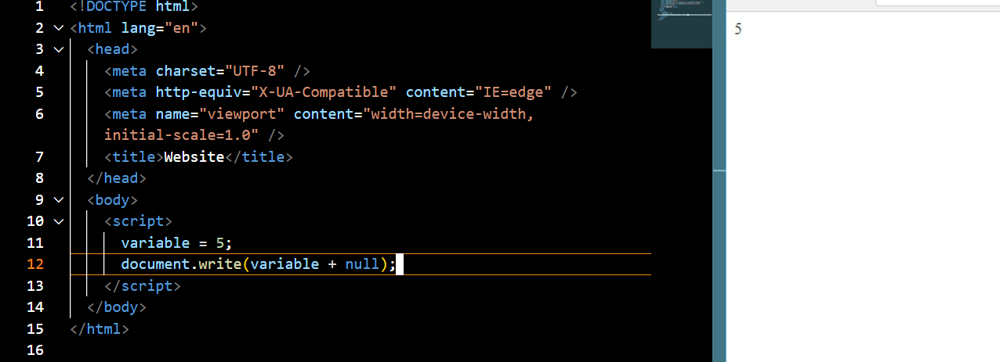

<hr>

```js
document.write("Sam+" + null); //Took null as a string
```

<hr>

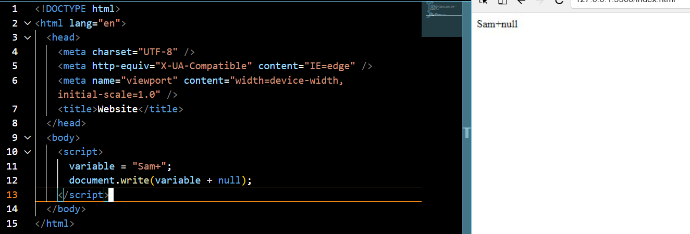

<hr>

```js
document.write(5 + "5"); //Converted variable to a string datatype
```

<hr>

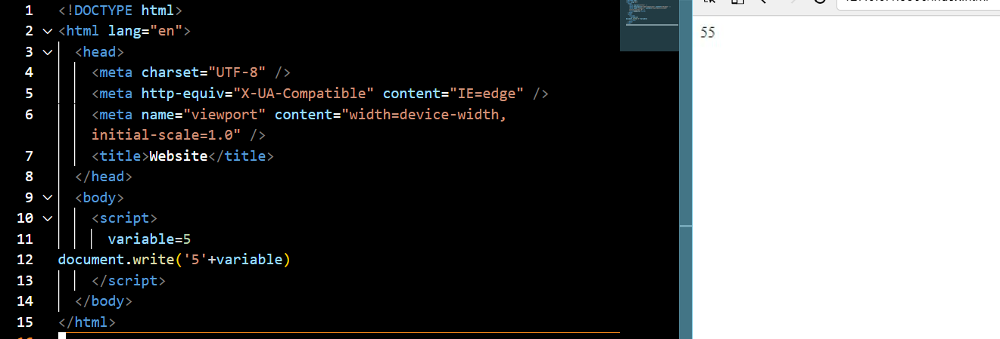

<hr>

```js
document.write(5 - 2); //Now variable's datatype would get converted to number
```

<hr>

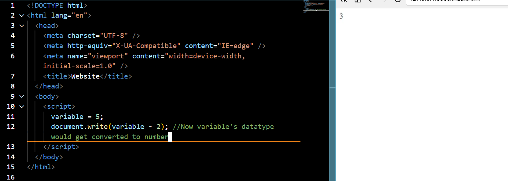

<hr>

```js
document.write("5" * "2"); //Converted both strings to numbers
```

<hr>

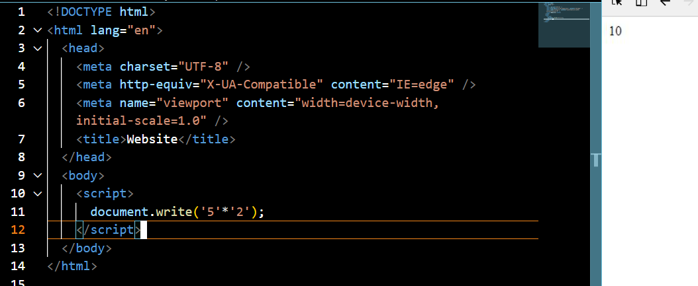

<hr>

# NaN Error

<hr>

- NaN is an error in JavaScript which stands for `Not A Number` and occurs when we mistakenly code smething like `document.write('5'*'yes')`.
- This happened because JavaScript while handling this error tried to convert `'yes'` to number datatype, which was unsuccessfull and hence resulted in this error.

<hr>

# Datatypes

<hr>

- There are basically 3 datatypes in JavaScript:-
- `String`
- `Number`
- `Boolean`

<hr>

# Type Conversion

<hr>

- There are basically these three functions in order to convert one type to another.
- `String()`
- `Number()`
- `Boolean()`
- If you ever do `Number("Sam")` which is obviously incorrect, then it returns `NaN` whose type is `Number`.
- `Number` of `true` is `1` while that of `false` is `0`.
- `Boolean` of `0` and `""`(Empty String) is `false` while that of all numbers except `0`, and all strings except empty string is `true`.

<hr>

# String Manipulation

<hr>

- To find length of string in JavaScript, we use `word.length` where word is the string.
- To get he character at a specified position of a string, we use `word[index]` where word is the string and index is the index value of character we want to access. (Index of first character is 0).
- Addittion of strings is directly possible.
- String concatenation can also be done using following method:

<hr>

```js
str1 = "Sam";
str2 = "Varghese";
fin_str = str1.concat(" ", str2); //Means fin_str=str1+" "+str2
document.write(fin_str);
```

<hr>

```js
let str1 = "Sam";
let str2 = " Varghese";
str1 += str2;
console.log(str1);
```

<hr>

- String Slicing in JavaScript is done using `word.substr(starting_index, word_length)`.
- String slicing can also be done using `word.substring(start_index, end_index)`.**Remember** that slicing like this would give string slice from start_index character till end_index-1 character.
- To get the starting index of a slice of string, we use `word.indexOf(slice)`.
- Now suppose if the slice exists multiple times in the string, then in order to specify to brwser, from which index we want it to begin the search for the slice, then the syntax is `word.indexOf(slice, index)` where index is simply the index after which we want browser to start the search for the slice.
- Now if we want browser to start search for the slice from end of string, then we use `word.lastIndexOf(slice)`.
- Now if the slice does not exists in word, then output is `-1`, similar to python.
- If we ever have a string with space at its begning and end, and if we wanna remove those(only start and end space, hence not exactly same as capwords), then we use `word.trim()`.
- Now if we just want to remove the extra spaces from start (& not from the end), then we use `word.trimStart()`.
- Similarly to remove extra spaces from only end, then we use `word.trimEnd()`.
- Now if we ever wanna make all letters capital, then we use `word.toUpperCase()`.
- Now, if we ever wanna make all letters in lower case, then we use `word.toLowerCase()`.
- Now if we ever wanna replace a something from a string, then we use `string.replace(string_to_be_replaced, replacing_string)`.
- Now if we ever wanna find wether a string is inside another string, then we use `main_string.includes(sub_string)` which gives output in either `true` or `false`.

<hr>

- It should be notes that string in JavaScript are immutable, example:

<hr>

```js
var a = "Sam";
a[0] = "A";
console.log(a);
// a would still be "Sam"
```

<hr>

- In order to find the last character of string even though we don't know the length of string, we use following method:

<hr>

```js
var a = "Elephant";
last_element = a[a.length - 1];
```

<hr>

# Arrays

<hr>

```js
arr1=[1,2,"Sam","Angel"];//Method1
arr2=new Array(1,2,"Sam","Angel",12);//Method2
console.log(`arr1=${arr1});
console.log(`arr2=${arr2});
```

<hr>

- To get a specific element of array do `array[index]`.
- In order to update an element of array, do `array[index]=new_value`.
- In order to find the length of array, do `array.length`.
- In order to append an element into the array, use `array.push(element)`.
- Pushed element will go at the end of the array.
- Suppose if we want to push the element at the begnning of the array, then use `array.unshift(element)`.
- In order to remove the last element of the array, use `array.pop()`.
- In order to remove the first element of an array, use `array.shift()`.
- In order to remove multiple elements from an array, we use `array.splice(start_index, no_of_elements)`.
- If we ever wanna empty an array just put `array.length=0` or simply `a=[]`.
- If we ever wanna get the index value of an element, just use `array.indexOf(element)`.
- **Note**: String can be called as an array of characters, hence all these functions can also be very well applied on a string.
- Suppose if we ever wanna check wether a given object is an array or not, (output in `true` or `false`) then we use `Array.isArray(object)`.
- In order to add arrays, we cant simply do so by `arr1+arr2` as it would then assume both `arr1` and `arr2` as strings.
- Hence we do so as follows:- `arr1.concat(arr2)`

<hr>

## Array Filter

<hr>

- Filter function is used to filter out values of an array on the basis of a specified condition, and return array of the values satisfying that condition.
- Following code shows the use of `filter` in order to filter out all positive values from an array.
- `filter` returns a value only if the inner function return `true`.

<hr>

```js
original_array = [1,2,3,-5,-4,-3,-2,-1,0];
filtered_array = original_array.filter((value){
  return value >= 0;
});
console.log(filtered_array);
```

<hr>

## Array Map

<hr>

- Returns a new array.
- Length of final array is always the same as that of array in which mapping is done. (unlike the filter function)
- Uses value from original array, while making a new one.

<hr>

```js
a = [1,2,3,4,5,6];
b = a.map(function (value) {
    return value+9
})
console.log(b)
```

<hr>

- Output of the above code is going to be: `[ 10, 11, 12, 13, 14, 15 ]`

<hr>

# Splitting

<hr>

- To split text. use `text.split(split_by)`.

<hr>

# Joining Array

<hr>

```js
arr1 = [1, 2, 3, 4, 5];
document.write(arr1.join(" then "));
```

<hr>

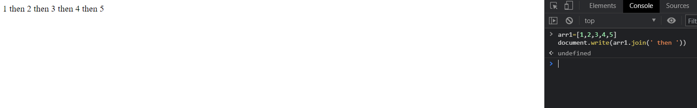

<hr>

# Iterating Through Array

<hr>

- ## _For_ Method

<hr>

```js
arr1 = ["word1", "word2", "word3", "word4", "word5", "word6"];
for (i = 0; i < arr1.length; i++) {
  console.log(arr1[i]);
}
```

<hr>

- ## _ForEach_ Method

<hr>

```js
arr1 = ["word1", "word2", "word3", "word4", "word5", "word6"];
arr1.forEach(func);

function func(value) {
  console.log(value);
}
```

<hr>

# Unique Values From Array

<hr>

- In order to get unique values from an array, we use `set`, which return set of unique values from that array.

<hr>

```js
let original_array = [1,1,2,2,3,3,4,4,6,6,8,8,9,9];
console.log(Array.from(new Set(original_array)));
```

<hr>

- The output of this code is going to be `[ 1, 2, 3, 4, 6, 8, 9 ]`.

<hr>

# Exception Handling

<hr>

- `try`: Used in order to instantly execute `catch` block is in case error gets generated.
- `catch`: Executed if `try` block gets an error.
- `finally`: Used in order to execute some code regardless the fact error happened or not.

<hr>

```js
try {
  console.log("Onto try block");
  unicycle;
} catch (err) {
  console.log(
    `Onto the catch block, here is all the information about the error: ${err}`
  );
} finally {
  console.log("Finally reached the finally block.");
}
```

<hr>

- Following is the output of this code: `Onto try block Onto the catch block, here is all the information about the error: ReferenceError: unicycle is not defined Finally reached the finally block.`.

<hr>

# Functions

<hr>

```js
function func_name(args) {
  code;
}
```

<hr>

- If we do not put any variables inside `func_name`, then also while calling the function we can add as many arguments as we want. Example has been shown below:

<hr>

```js
function add() {
  console.log(arguments); //All arguments that we put are in array named arguments
  let sum = 0;
  for (i = 0; i < arguments.length; i += 1) {
    sum += arguments[i];
  }
  document.write(`<br>Sum of the array is=${sum}`);
  return sum; //In case of no return function, Undefined is returned
}
add(1, 2, 3, 4, 5);

let addition = add; //This will enable function to be called even when addition is written, like addition(1,2,3,4,5);
```

<hr>

```js
let func = function () {
  //Called function expression
  //Functions like this are called ANONYMOUS FUNCTIONS
  //If we dont assign any name to this function then anonymous functions would produce error.
  console.log("Hello World!");
}; //Making functions like this is also valid in JavaScript
```

<hr>

# Arrow Functions

<hr>

- `Arrow Functions` are just a bit quicker method to write `Anonymous Functions`. following code shows its syntax:

<hr>

```js
var magic = () => {
  return 5;
};
```

<hr>

- The above function can be written in a much more summarized manner:

<hr>

```js
var magic = () => 5;
// This code simply tells to return 5
// This style is used only when function simply return and does no work in between
```

<hr>

## Passing Parameters In Arrow Function

<hr>

```js
var myConcat = (arr1, arr2) => arr1.concat(arr2);
console.log([1, 2, 3], [4, 5, 6]);
```

<hr>

# Scope

<hr>

- Variables declared outside the function are global variables.
- **Important**: Variables declared without `var`, are **global automatically**. While variables declared with `var` are **not global**.
- If we declare a variable in local scope that has already been declared in global scope, then in local that variable's value would be the value declared in local scope while outside that scope variable's value wouls be that declared in global scope.

<hr>

# setTimeout Function

<hr>

- In JavaScript, suppose if we ever want a function to get executed after a certain time interval, then we use this function.

<hr>

```js
function say() {
  console.log("Hello sir");
}
setTimeout(say, 3000); //setTimeout(function_name, time in milli seconds);

//OR

setTimeout(function () {
  console.log("Hello sir");
}, 3000); //Using anonymous function to save memory associated with the name of functions
```

<hr>

# Immediately Invoked Functions

<hr>

- These are the functions that are Immediately executed while they are being made a function.
- Apart from the benefit that they immediately invoke the function, they are also used to be safe from error of double declaration of same variable which happens usually when we use a third party library and their and our variable (some of them) are same , and double declaration of variable is prohibited in JavaScript. (Unless and until this happens inside a function)

<hr>

```js
(function func() {
  console.log("Hello world");
  alert("Hello sir");
})();
```

<hr>

# Objects

<hr>

**Method 1**

<hr>

```js
let person = {
  first_name: "Sam", //Remember, only ',' and no ';'
  last_name: "Varghese",
  age: 17,
  school: "Sica",
};
console.log(`First name=${person.first_name}`);
//Or
console.log(`First name=${person["first_name"]}`);
```

<hr>

**Method 2**

<hr>

```js
var person=new Object();
person.first_name="Sam";
person.last_name"Varghese";
person.age=17;
person.school="Sica";
```

<hr>

- **Note**: Suppose if you really wanted to put a space in place of the underscore in `first_name`, then do that in the following way:

<hr>

```js
let person = {
  "first name": "Sam",
  "last name": "Varghese",
  age: 17,
  school: "Sica",
};
console.log(`First name=${person["first name"]}`); //Dot notation of objects wont work hence dont use spaces
```

<hr>

- To add a new property to the object, from outside `let person=`'s bracket, use the following method:-

<hr>

```js
let person = {
  first_name: "Sam",
  last_name: "Varghese",
  age: 17,
  school: "Sica",
};
person.city = "Indore";
console.log(person);
```

<hr>

# Deleting An Object property

<hr>

- If we ever wanna delete a property of an object, then use the following method:-

<hr>

```js
let person = {
  first_name: "Sam",
  last_name: "Varghese",
  age: 17,
  school: "Sica",
};

delete person.first_name;
console.log(person);
```

<hr>

# Checking Presence Of A Property

<hr>

```js
let person = {
  first_name: "Sam",
  last_name: "Varghese",
  age: 17,
  school: "Sica",
};
console.log("City" in person);
```

<hr>

OR

<hr>

```js
let person = {
  first_name: "Sam",
  last_name: "Varghese",
  age: 17,
  school: "Sica",
};
console.log(person.hasOwnProperty("City"));
// Returns in true/ false
```

<hr>

# Iterating Through Object Properties

<hr>

```js
let person = {
  first_name: "Sam",
  last_name: "Varghese",
  age: 17,
  school: "Sica",
};
for (let key in person) {
  console.log(key + ": " + person[key]); //Remember dot notation won't work here
}
```

<hr>

# Method

<hr>

- A function associated with an object is called a **method**.

<hr>

```js
let person = {
  first_name: "Sam",
  last_name: "Varghese",
  age: 17,
  school: "Sica",
};

person.sayhello = function () {
  //Here anonymous function has been used, you can also use normal functions
  document.write("Hello from person");
  alert("Hello");
};

person.sayhello(); //Don't forget these parenthesis
```

<hr>

OR

<hr>

```js
let person = {
  first_name: "Sam",
  last_name: "Varghese",
  age: 17,
  school: "Sica",
  sayhello() {
    document.write("Hello from person"); // Inroduced in ES6 probably
    alert("Hello");
  },
};

person.sayhello();
```

<hr>

# This Keyword

<hr>

- Suppose if we have an object which want to access some properties of that same function, then at that situation, though we can use `object_name.property`, but we can also use `this.property` where `this` refers to the object name until and unless we are using this inside the same object.

<hr>

```js
person = {
  first_name: "Sam",
  last_name: "Varghese",
  sayhello() {
    console.log(`Hello Master ${this.first_name}`);
  },
};
person.sayhello();
```

<hr>

# Math Object

<hr>

- There is already a math object in JavaScript for mathematical calculations.

<hr>

## PI

<hr>

- To get the value of Pi, just use `Math.PI`.

<hr>

## Eulers Number

<hr>

- To get the value of eulers number, just use `Math.E`.

<hr>

## Round Off

<hr>

- In order to round off a number, use `Math.round(number)`.

<hr>

## Ceil

<hr>

- In order to get the `ceil` value, just use `Math.ceil(number)`.

<hr>

## Floor

<hr>

- In order to get the floor value, we use `Math.floor(number)`.

<hr>

## Trunc

<hr>

- If we wanna see only the integer part of a number, and remove its decimal part, then we use `Math.trunc(number)`.

<hr>

## Power

<hr>

- If we ever wanna find out the power to any number, then we can either do this simply by `base**num`, and for more accurate answers, we use `Math.pow(base, num)`.

<hr>

## Square Root

<hr>

- To find square root, we can obviously do `num1**(1/2)`, but for accurate answers, we use `Math.sqrt(4)`

<hr>

## Minimum

<hr>

- In order to find the minimum number among many such numbers, we use `Math.min(num1, num2, ....., numn)`.

<hr>

## Maximum

<hr>

- In order to find maximum, we use `Math.max(num1, num2, ......, numn)`.

<hr>

## Random

<hr>

- Suppose if we wanna find a random number in range [0,1), use `Math.random()`.
- We generate all random numbers only through this function.
- In general, if we wanna find a integer random number in range `[max, min)`, then we use formula, `Math.floor(Math.random()*(max-min))+min`.
- And if we ever wanna have a random floating point number in range `[max, min)`, then just remove `Math.floor()` from the above formula.

<hr>

# parseInt Functions

<hr>

- If we have a string which is basically an integer string, and if we wanna convert that from string to number, then we use the `parseInt` function.

<hr>

```js
integer = parseInt("123");
```

<hr>

- Suppose if we have a binary number (or number to any base), and we wanna convert it to number in decimal form, then we do that by following method:

<hr>

````js
integer = parseInt("11010", 2);
// parseInt("Number in any base", that_base)

<hr>

# parseFloat Functions

<hr>

- Works very similar to `parseInt`, but converts string floats to number floats.

<hr>

# Date Object

<hr>

- In order to deal with date and times, we use date object of JavaScript.

<hr>

```js
current = new Date(); //In order to generate present time-stamp
document.write(current);
````

<hr>

- If we wanna generate time stamp of some specific date-time, use following:

<hr>

```js
time_stamp = new Date(2018, 1, 12, 13, 12, 49, 999); //new Date(Year, Month, Date, Minutes, Seconds, MilliSeconds)
document.write(time_stamp);
```

<hr>

- We can also convert dates of out format to standard form, as follows:-

<hr>

```js
custom_date = "10/28/2021 11:45:48:345"; //should be mm/dd/yyyy hh/mm/ss
stand_time = new Date(custom_date);
document.write(stand_time);
```

<hr>

- **Zero time is January 01, 1970 00:00:00 UTC.**
- All timestamps with which JavaScript actually deals is in milliseconds which have passed since January 01, 1970 00:00:00 UTC.
- In order to get time in milliseconds, we use `time_stamp.getTime()`.

<hr>

## Fetching Data From timestamp

<hr>

- In order to get just **year** from time stamp, we use `time_stamp.getFullYear()`
- In order to get the **month number**, we use `time_stamp.getMonth()`. Here **January is 0**.
- In order to get **date(dd)**, we use `time_stamp.getDate()`.
- In order to get the **hour**, we use `time_stamp.getHours()`.
- In order to get the **minutes**, we use `time_stamp.getMinutes()`.
- In order to get **seconds**, we use `time_stamp.getSeconds()`.
- In order to get the **day**, we use `time_stamp.getDay()`. Here **Sunday is 0**.

<hr>

## Updating TimeStamp

<hr>

- If we ever wanna **change year** of the timestamp, then we use `time_stamp.setFullYear(new_year)`.
- If we ever wanna **change month** of the timestamp, then we use `time_stamp.setMonth(new_month_number)`.
- If we ever wanna **change date** of the timestamp, then we use `time_stamp.setDate(new_date)`.
- If we ever wanna **change hours** of the timestamp, then we use `time_stamp.setHours(new_hour)`.
- If we ever wanna **change minute** of the timestamp, then we use `time_stamp.setMinutes(new_minute)`.
- If we ever wanna **change seconds** of the timestamp, then we use `time_stamp.setSeconds(new_second)`.

<hr>

## Getting Future TimeStamp

<hr>

- Suppose if we wanna get a timestamp after 50 days from a given timestamp x, use:-

<hr>

```js
let x = new Date();
x.setDate(x.getDate() + 50); //50 is actually 50 days
console.log(x);
```

<hr>

- **Remember** that direct comparision of `new Date(...)` is possible as these timestamps are actually stored in milliseconds.

<hr>

# Getter

<hr>

- Just see the following code:-

<hr>

```js
let person = {
  first_name: "Sam",
  last_name: "Varghese",
  Class: 12,

  get_name: function () {
    return this.first_name.toUpperCase(); //Hope you remember this :)
  },
};
console.log(get_name());
```

<hr>

- One disadvantage of the above method is that we are calling method not as a property (as property doesn't have parenthesis), but rather like a method (as methods have parenthesis). Hence if we really wanna call `get_name` as a property, then do as follows:-

<hr>

```js
let person = {
  first_name: "Sam",
  last_name: "Varghese",
  Class: 12,

  get get_name() {
    return this.first_name.toUpperCase();
  },
};
console.log(person.get_name);
```

<hr>

# Setter

<hr>

- Suppose if we ever wanna change a property of an object, but after processing a given data, and if this task hasto be repeated multiple times, then setter functions can be helpful.

<hr>

```js
let person = {
  first_name: "Sam",
  last_name: "Varghese",
  Class: 12,

  set set_name(name) {
    this.first_name = name.toUpperCase();
  },
};
person.set_name = "rohan";
console.log(person.first_name);
```

<hr>

# Regular Expressions (RegEx)

<hr>

- Define a search pattern that can be used to search for things in a string.

<hr>

## Test

<hr>

- `test` in RegEx is used in order to get `true` in case a pattern is present in a string, else `false`.
- this is case sensitive.

<hr>

```js
my_RegEx = /sam/;
console.log(my_RegEx.test("Hi, myself Sam"));
//Output would be true
```

<hr>

- We can also check for presence of multiple string using `or` ie `|` inside RegEx itself.

<hr>

```js
RegEx = /Sam|Angel|Hi/;
console.log(RegEx.test("Hi, myself Rahul"));
```

<hr>

- While testing for the presence of a string in another string, we can also tell browser to ignore case by putting an `i` after `/`.

<hr>

```js
RegEx = /Sam|Angel|Hi/i;
console.log(RegEx.test("hi, myself Rahul"));
```

<hr>

## Match

<hr>

- In order to extract the substring from the main string that satisfies the given condition, we use `match`.
- Note that `match` gives information **of only first match and not rest matches.**

<hr>

```js
RegEx = /Sam|Angel|Hi/i;
let a = "haim, myself Rahul\nof sam".match(RegEx);
console.log(a);
```

<hr>

- Output of the above code would be:

<hr>

```js
[
  'sam',
  index: 22,
  input: 'haim, myself Rahul\nof sam',
  groups: undefined
]
```

<hr>

- In order to find all matches of specified pattern in a string, we use `g` flag.

<hr>

```js
RegEx = /Sam|Angel|Hi/g;
let a = "haim Sam, myself Rahul\nof sam".match(RegEx);
console.log(a);
```

<hr>

- In order to use `i` flag also, put `ig` instead of `g` in above code.

<hr>

- Suppose if we have a RegEx pattern that searches for a substring and we have a string that starts with that substring, then using conventional match method we are gonna get only substring in return. In order to get whole string, we use **`.`** (full stop) .

<hr>

```js
RegEx = /Sam.|Angel|....Hi/gi;
let a = "haim Samu, myself Rahul\nof samk\nAarohi".match(RegEx);
console.log(a);
```

<hr>

- Output of the above code is `[ 'Samu', 'samk', 'Aarohi' ]`.
- Now suppose if we wanna find any word among `bag`, `big`, `bug`, from a given string (note that these words start eith `b` and end with `g`, leaving middle word an alphabet among `a`, `i`, or `g`), then to have these types of searches, we have:

<hr>

```js
let a = "get one out of bag, or big or bug";
RegEx = /b[a,i,u]g/g;
console.log(a.match(RegEx));
```

<hr>

- Output of the above code would be `[ 'bag', 'big', 'bug' ]`.

<hr>

- If we ever wanna check for presence of alphabets from suppose a to z, then we can do the folllowing method:

<hr>

```js
RegEx = /S[a-z]m/gi;
str =
  "Hi myself Sam, this is an example to check for the presence of Smm and stm, lets see if they come or not.";
console.log(str.match(RegEx));
```

<hr>

- The output of following code would be `[ 'Sam', 'Smm', 'stm' ]`.

<hr>

- We can have patterns similar to alphabet ranging that work for numbers in the following way:

<hr>

```js
str = "9906779482";
RegEx = /[0-9][0-9][0-9][0-9][0-9][0-9][0-9][0-9][0-9]/;
str.match(RegEx);
```

<hr>

- Output in this case is going to be `[ '990677948', index: 0, input: '9906779482', groups: undefined ]`.

<hr>

- Sometimes we might want to do pattern matching on the basis of absence of any specific character. For that we use `[^character list to be ignored]`.

<hr>

```js
str = "9906779482";
RegEx = /[^a][0-9][0-9][0-9][0-9][0-9][0-9][0-9][0-9]/;
console.log(str.match(RegEx));
```

<hr>

- The output of above code would be `str = "9906779482"; RegEx = /[^a][0-9][0-9][0-9][0-9][0-9][0-9][0-9][0-9]/; console.log(str.match(RegEx));`.

<hr>

- Now, If we wanna have a pattern such that we have search result containing element wherein we have multiple/ single occurrence of a specified character. This kind of search is done as follows:

<hr>

```js
let word = "Sammonmismmm";
let RegEx = /m+/g;
console.log(word.match(RegEx));
```

<hr>

- Now, if we wanna have a pattern search wherein we have to search for set of character occuring once and then some characters repeating any number of times (0 or more), then we use following method:

<hr>

```js
str = "AahoooooooooooooooooReAahooooooooo";
Reg_Ex = /Aaho*/g;
console.log(str.match(Reg_Ex));
```

<hr>

- The output of the following code would be `[ 'Aahooooooooooooooooo', 'Aahooooooooo' ]`.

<hr>

- There are teo kinds of matches, first one being _Greedy Match_ and other _Lazy Match_.

<hr>

- _Greedy match_ is a match which by default selects the largest possibe substring satisfying a pattern.
- _Lazy Match_ on the other hand selects the smallest possible substring satisfying a condition.

<hr>

```js
let orig_str = "Titanic";
RegEx = /t[a-z]*i/i;
new_str = orig_str.match(RegEx);
console.log(new_str);
// new_str in this case is greedy search result which is set as default
```

<hr>

- Above code produces _Titani_ as the output.
- This is a result of greedy search.
- In order to execute _lazy search_, just put a _?_ as shown:

<hr>

```js
let original_string = "Titanic";
RegEx = /T[a-z]*?i/i;
console.log(original_string.match(RegEx));
```

<hr>

- In this case our output would be `[ 'Ti', index: 0, input: 'Titanic', groups: undefined ]`.
- Similarly, the out of following code:

<hr>

```js
let text = "<h1>Winter is comming</h1>";
RegEx = /<.*>/;
console.log(text.match(RegEx));
RegEx = /<.*?>/;
console.log(text.match(RegEx));
```

<hr>

- Output by first `console.log` is going to be `[ '<h1>Winter is comming</h1>', index: 0, input: '<h1>Winter is comming</h1>', groups: undefined ]` while output by second `console.log` is going to be `[ '<h1>', index: 0, input: '<h1>Winter is comming</h1>', groups: undefined ]`.

<hr>

- In order to check for a specific string in the begning of another string, we use following method:

<hr>

```js
let text = "Cal and Ricky both like racing";
let RegEx = /^Cal/;
console.log(RegEx.test(text));
```

<hr>

- Output in this case is going to be `true`.
- It would have been `false` if `test = "Ricky and Cal both like racing."`.
- In order to look for presence of a string at the end, we put a `string$`. Example:

<hr>

```js
let text = "Hi, myself sam.";
let RegEx = /.$/;
console.log(RegEx.test(text));
```

<hr>

- Output of the above code is going to be `true`.

<hr>

## Metacharacter

<hr>

<table class="w3-table-all notranslate">
  <tbody><tr>
    <th style="width:22%">Metacharacter</th>
    <th>Description</th>
  </tr>
  <tr>
    <td><a href="jsref_regexp_dot.asp">.</a></td>
    <td>Find a single character, except newline or line terminator</td>
  </tr>
  <tr>
    <td><a href="jsref_regexp_wordchar.asp">\w</a></td>
    <td>Find a word character</td>
  </tr>
  <tr>
    <td><a href="jsref_regexp_wordchar_non.asp">\W</a></td>
    <td>Find a non-word character</td>
  </tr>
  <tr>
    <td><a href="jsref_regexp_digit.asp">\d</a></td>
    <td>Find a digit</td>
  </tr>
  <tr>
    <td><a href="jsref_regexp_digit_non.asp">\D</a></td>
    <td>Find a non-digit character</td>
  </tr>
  <tr>
    <td><a href="jsref_regexp_whitespace.asp">\s</a></td>
    <td>Find a whitespace character</td>
  </tr>
  <tr>
    <td><a href="jsref_regexp_whitespace_non.asp">\S</a></td>
    <td>Find a non-whitespace character</td>
  </tr>
  <tr>
    <td><a href="jsref_regexp_begin.asp">\b</a></td>
    <td>Find a match at the beginning/end of a word, beginning like this: \bHI, 
    end like this: HI\b</td>
  </tr>
  <tr>
    <td><a href="jsref_regexp_begin_not.asp">\B</a></td>
    <td>Find a match, but not at the beginning/end of a word</td>
  </tr>
  <tr>
    <td><a href="jsref_regexp_nul.asp">\0</a></td>
    <td>Find a NULL character</td>
  </tr>
  <tr>
    <td><a href="jsref_regexp_newline.asp">\n</a></td>
    <td>Find a new line character</td>
  </tr>
  <tr>
    <td><a href="jsref_regexp_formfeed.asp">\f</a></td>
    <td>Find a form feed character</td>
  </tr>
  <tr>
    <td><a href="jsref_regexp_carriagereturn.asp">\r</a></td>
    <td>Find a carriage return character</td>
  </tr>
  <tr>
    <td><a href="jsref_regexp_tab.asp">\t</a></td>
    <td>Find a tab character</td>
  </tr>
  <tr>
    <td><a href="jsref_regexp_vtab.asp">\v</a></td>
    <td>Find a vertical tab character</td>
  </tr>
  <tr>
    <td><a href="jsref_regexp_octal.asp">\xxx</a></td>
    <td>Find the character specified by an octal number xxx</td>
  </tr>
  <tr>
    <td><a href="jsref_regexp_hex.asp">\xdd</a></td>
    <td>Find the character specified by a hexadecimal number dd</td>
  </tr>
  <tr>
    <td><a href="jsref_regexp_unicode_hex.asp">\udddd</a></td>
    <td>Find the Unicode character specified by a hexadecimal number dddd</td>
  </tr>
</tbody></table>

<hr>

## Quantity Match Specifier

<hr>

- In order to have a pattern with specified number of repetetions of another pattern, then in order to specify number of repetetions of that basic pattern, we use the following method:

<hr>

```js
var text = "100, 1000 or 10000";
var patt1 = /\d{4}/g;
// Pttern is to get all numbers with 4 or more integers
console.log(text.match(patt1));
```

<hr>

- Output of the above code is going to be `[ '1000', '1000' ]`.

<hr>

- In the above code, we saw that we got all numbers with 4 or more digits. Now in order to have specific number of numbers (in range), we do as follows:

<hr>

```js
var text = "100, 1000, 10000, 100000, 1000000, 10000000";
var RegEx = /\d{4,6}/g;
console.log(text.match(RegEx));
// Insted of {4,6} put {4,} in order to have upper limit as infinity
```

<hr>

- The output of the following code would be `[ '1000', '10000', '100000', '100000', '100000' ]`.
- In the above code, dont put `,` in `{4, 6}`, rather put `{number}` in order to have exact number match.

<hr>

## Specifying Optional Character

<hr>

- Suppose if we havve to search for string _favorite_ and _favourite_, from another string, then as we can notica, we only need to specify through our RegEx pattern that _u_ at 4th index is optional.
- To specify these kinds of requirenments, we just put `?` after character that has to be set optional.

<hr>

```js
let text = "So, what is your favourite or favorite color?";
RegEx = /favou?rite/g;
console.log(text.match(RegEx));
```

<hr>

- The output of the above code is going to be `[ 'favourite', 'favorite' ]`.

<hr>

## Positive And Negative LookAhead

<hr>

- Positive look ahead means a pattern wherein we search for a string after which comes a particular character, or set of characters. Note that in output, we wish to get the string only and not the charaters ahead of that which fulfilled the required pattern.

<hr>

```js
// POSITIVE LOOKAHEAD
let text1 = "qu";
let RegEx1 = /q(?=u)/g;
```

<hr>

- The output of the above code is `['q']`.

<hr>

```js
// NEGATIVE LOOKAHEAD
let text2 = "qt";
let RegEx2 = /q(?!u)/;
 <!-- !u means that next character should'nt be u  -->
console.log(text2.match(RegEx2));
```

<hr>

- The output of the following code is `[ 'q', index: 0, input: 'qt', groups: undefined ]`.

<hr>

## Repeating Patterns Inside RegExp

<hr>

- Suppose we have a following RegExp: `/(w+)\s(w+)/`, so in this example, we can see that first pattern `(w+)` was to be repeated twice, so we would have done this easily as follows:

<hr>

```js
RegExp = /(w+)\s\1/;
// \1 means to repeat first pattern
```

<hr>

# Object Constructor (Classes)

<hr>

- Instead of making multiple objects of same type, JavaScript gives us object constructors which can make this big task eaier.

<hr>

```js
function Student(first_name, last_name, age, school) {
  this.first_name = first_name; //Only = and ;
  this.last_name = last_name;
  this.age = age;
  this.school = school;
}
Student1 = new Student("Sam", "Varghese", 17, "Sica");
console.log(
  `Information about Student\nFirst name: ${Student1.first_name}\nLast name: ${Student1.last_name}\nAge: ${Student1.age}\nSchool: ${Student1.school}`
);
```

<hr>

- If you ever wanna create more properties for an object (without disturbing the main object constructor), then just do as follows:-

<hr>

```js
function Student(first_name, last_name, age, school) {
  this.first_name = first_name; //Only = and ;
  this.last_name = last_name;
  this.age = age;
  this.school = school;
}
Student1 = new Student("Sam", "Varghese", 17, "Sica");
Student1.country = "India"; //Do like this
console.log(
  `Information about Student\nFirst name: ${Student1.first_name}\nLast name: ${Student1.last_name}\nAge: ${Student1.age}\nSchool: ${Student1.school}\nCountry: ${Student1.country}`
);
```

<hr>

- If we ever wanna make a nested objects, then simply do as shown:

<hr>

```js
Student = {
  name: "Sam",
  address: { City: "Indore", Country: "India", State: "MP" }, //Do like this
};
console.log(Student.address.City);
```

<hr>

# Adding A New Property To Object Constructor

<hr>

- Suppose at any point of time you are wanting to add one more property to the object constructor, then use the following `prototype` method to do so.

<hr>

```js
function Student(first_name, last_name, age, school) {
  this.first_name = first_name; //Only = and ;
  this.last_name = last_name;
  this.age = age;
  this.school = school;
}
Student.prototype.Nationality = "Indian";
Student1 = new Student("Sam", "Varghese", 17, "School");

console.log(Student1.Nationality);
```

<hr>

# Hoisting

<hr>

- This is a feature of JavaScript to firstly read all the code and then put all declaration statements above.
- Hence if you call a function before it has been declared, then also our program will run smoothly as it would have already read the declaration and put it above.

<hr>

- But if we put the following code:-

<hr>

```js
var x;
console.log(x);
x = 10;
```

<hr>

- Then, according to our expectations, our console shoul show `10`, but console in this case actually shows `undefined`. This is because whenever we declare a variable like this, then variable automatically gets `undefined` unless and until it is maunally defined by us.

<br>

- So, if we put the following code:-

<br>

```js
x = 10;
console.log(x);
var x;
```

<hr>

- Then, our output would be `10`, as variable has been defined by us.

<hr>

- But suppose we do as follows:-

<hr>

```js
console.log(x);
var x;
x = 10;
```

<hr>

- Then in this case we would get `undefined` as output as JavaScript in this case just put `var x;` above `console.log(x);`.

<hr>

- Now suppose if we put this code:

<hr>

```js
console.log(x);
var x = 5;
```

<hr>

- In this case, this code gets transformed to:-

<hr>

```js
var x; //Declaration step shifted up
console.log(x);
x = 5;
```

<hr>

- Hence out in this case would also be `undefined`.

<hr>

- Now suppose if we use `let` as follows:-

<hr>

```js
console.write(x);
let x = 10;
```

<hr>

- As seen from above points, we may conclude that output would be `undefined`, but here we woud get the error that this variable has never been initialised. This is because **unlike `var`, `let` does not assigns variable an `undefined` value**.

<hr>

- Suppose now we code as follows:-

<hr>

```js
x = 5; //No declaration done
console.log(x);
```

<hr>

- We might think that in this case we should get an error as we forgot to declare the type of variable before initializing it, but here we would get no error, rather 5 as an output. This happened because JavaScript automatically detects this error and puts declaration by itself.
- But this feature can become a cause of many errors while coding, hence to disable this feature of JavaScript, we write `"use strict"` inthe topmost line of our file.

<hr>

# DOM

<hr>

- **D**ocument **O**bject **M**odel is an **A**pplication **P**rogramming **I**nterface for manipulating HTML and XML documents. (add, remove or modify parts of the document/HTML).

<hr>

- When a web page is loaded, the browser creates a Document Object Model of the page.
- **Note**: In this DOM tree, the document is the root node or object.
- **Note**: In DOM, all HTML objects are defined as objects, so it will have both property and method.
- The document object represents your web page.
- If you wanna access any HTML element in a HTML page, you always start with accessing the document object.

<hr>

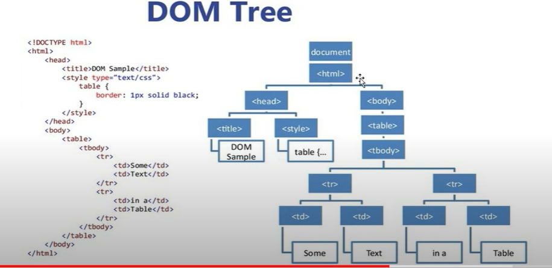

<hr>

- With object model, JavaScript gets all the powers it needs to create dynamic HTML.
- JavaScript can change all HTML elements in the page.
- JavaScript can change all HTML attributes in the page.
- JavaScript can change all CSS styles in the page.
- JavaScript can remove existing HTML elements and attributes.
- JavaScript can add new HTML elements and attributes.
- JavaScript can react to all existing HTML events int the page.
- JavaScript can create new HTML events in the page

<hr>

# Selecting Element By ID

<hr>

Pt39 7:38
